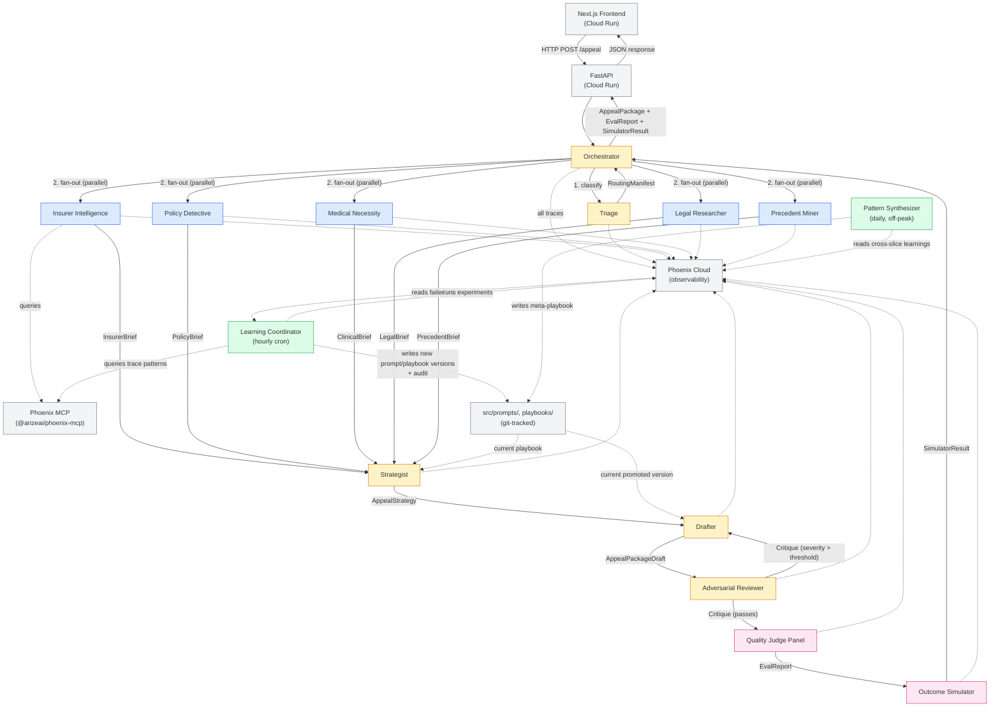

# Aegis — System Architecture

**Date:** 2026-05-27 · **Status:** Active · **Skill:** `agent-system-architecture`
**Companion docs:** [PRD](../prd/PRD.md) · [Design Brief](../design-brief.md) · [ADRs](../adr/) · [Decision Log](../memory/decision-log.md) · [Assumption Map](../research/assumption-map.md)

This document is the source-of-truth technical blueprint. It replaces the freehanded `docs/architecture.md` from Session 1 (now archived in-place as a thin pointer to this file). When the system shape changes, update this file first.

---

## 1. System Overview

### 1.1 Objective

Aegis helps people draft US health-insurance appeal letters that are factually grounded, plan-language-specific, and tactically informed by per-insurer learning. The system **demonstrably improves** at this job over time by introspecting its own Arize Phoenix traces via the Phoenix MCP server at runtime, and by promoting better prompts / playbooks through a Learning Coordinator with hard safety gates.

Two co-existing phases:
- **Part A — MVP (Days 1–7).** Single ADK agent + one offline learning job. 12-case benchmark, 3 insurers × 2 denial types. Human-approval gate for every promotion. Shippable as a complete Arize-track submission on Day 7.
- **Part B — Full Plan (Days 8–20).** 12-agent swarm + Learning Coordinator + Pattern Synthesizer. 100-case benchmark, 10 insurers × 7 denial types. Autonomous promotion gated by hard safety checks; one-click rollback.

### 1.2 Ambiguity Level

**Mixed.** The runtime pipeline (case → research → strategy → draft → review → score) is a fixed workflow. The learning loop is open-ended exploration (which slice to improve, which patches to propose, which to promote).

### 1.3 Hard constraints carried from [AGENTS.md](../../AGENTS.md)

- No PHI anywhere. Synthetic composite cases only.
- No invented statutes, case law, or policy text. Citations from controlled local corpus only.
- Phoenix MCP must be load-bearing — quality visibly degrades when disabled (demo counterfactual).
- Disclaimers on every output: "Not legal or medical advice. Draft assistance only."
- Two Cloud Run services (Next.js frontend + Python ADK backend).
- Apache 2.0 license.

---

## 2. Orchestration Pattern

### Part A (MVP)
**Sequential pipeline** (one ADK agent with 7 tools called in fixed order) + **batch offline learning job** (manual trigger, human approval).

### Part B (Full Plan)
**Composite Pattern** combining 6 of Google's 8 [official ADK multi-agent patterns](https://developers.googleblog.com/developers-guide-to-multi-agent-patterns-in-adk/):

| Sub-pattern | Where it appears in Aegis |
|---|---|
| **Coordinator / Dispatcher** | Orchestrator + Triage Agent route the incoming case |
| **Parallel Fan-Out / Gather** | 4 specialist researchers run concurrently after Triage |
| **Sequential Pipeline** | Strategist → Drafter → Adversarial Reviewer → Quality Judge Panel → Outcome Simulator |
| **Generator + Critic** | Drafter ↔ Adversarial Reviewer iteration |
| **Iterative Refinement** | Drafter can rewrite up to N=2 times based on Reviewer critique |
| **Human-in-the-Loop** | Part A: every promotion requires human click. Part B: hard safety-gate auto-promotion; one-click rollback always available; PM-visible audit log |

Hierarchical patterns are deliberately avoided — the Learning Coordinator is a *background* meta-agent that reads traces and writes prompts/playbooks, not a manager that delegates to runtime agents. This keeps runtime coordination flat.

---

## 3. Agent Definitions

### 3.1 Honest agent count

PRD §12 calls Part B a "12-agent swarm." For architectural honesty:
- **10 LLM agents** with distinct prompts and roles
- **1 LLM-as-judge panel** (the Quality Judge Panel — 7 graders, but the panel itself is not an "agent" in the autonomous-actor sense; it's an evaluation surface)
- **1 mostly-deterministic evaluator** (the Outcome Simulator — rule engine + 1 LLM feature-extraction call)
- **+ 2 background meta-agents** (Learning Coordinator, Pattern Synthesizer)

Total of 14 components. The "12-agent" framing is preserved in product copy and pitch; the architecture is documented as 10+1+1+2.

### 3.2 Runtime agents (Part B)

| # | Agent | Role | Tools / inputs | Output | Notes |
|---|---|---|---|---|---|
| 1 | **Orchestrator** | Receives the case, dispatches through the pipeline, manages parallel research, holds the trace-context for the run | Input: parsed `CaseJSON`. Owns ADK `session.state`. Sub-agent calls. | Final `AppealPackage` returned to FastAPI handler | Coordinator pattern. Gemini 2.5 Flash (cheap, fast routing). |
| 2 | **Triage Agent** | Classifies denial type + complexity, decides which specialists run, outputs routing manifest | Input: `CaseJSON`. Tool: classification prompt. | `RoutingManifest` (which specialists, in what depth) | Could collapse into Orchestrator post-MVP if simplification needed. |
| 3 | **Insurer Intelligence Agent** | The Phoenix-MCP-heavy agent. Queries past traces for the current `(insurer, denial_type, state)` slice. Pulls failure patterns + success traits + currently-promoted prompt/playbook versions. | Tool: `@arizeai/phoenix-mcp` (`phoenix_trace_summary`). Tool: `get_learned_playbook`. | `InsurerBrief` | **This is the load-bearing MCP agent.** Removing MCP from this agent visibly collapses quality. |
| 4 | **Policy Detective** | Deep-reads plan documents in the case, extracts relevant clauses, identifies plan-language inconsistencies | Tool: BM25 retrieval over `corpus/authorities/` + uploaded plan doc. | `PolicyBrief` | Researcher pool member; runs in parallel with #5–#7. |
| 5 | **Medical Necessity Researcher** | Retrieves AMA/specialty society guidelines, InterQual/MCG summaries, USPSTF recommendations, peer-reviewed evidence | Tool: BM25 over `corpus/authorities/clinical/`. | `ClinicalBrief` | Researcher pool member. |
| 6 | **Legal Researcher** | Federal (ERISA, ACA §2719, MHPAEA, No Surprises Act) + state law + recent CMS enforcement | Tool: BM25 over `corpus/authorities/legal/`. | `LegalBrief` | Researcher pool member. |
| 7 | **Precedent Miner** | Searches state insurance commissioner decisions, ProPublica *Denied* cases, public IRO decisions | Tool: BM25 over `corpus/authorities/precedent/`. | `PrecedentBrief` | Researcher pool member. |
| 8 | **Strategist Agent** | Synthesizes all 5 briefs (Insurer + Policy + Clinical + Legal + Precedent), picks an angle of attack, selects playbook tactics, outputs structured `AppealStrategy` | Inputs: 5 briefs. Tool: `get_learned_playbook`. | `AppealStrategy` (angles, plan-citation list, evidence requests) | Gemini 3 (expensive, high-reasoning). |
| 9 | **Drafter Agent** | Writes the actual appeal letter, using current promoted prompt version | Inputs: `AppealStrategy` + briefs. Tool: current `system_prompt_vN` + `workflow_prompt_vN` from `src/prompts/`. | `AppealPackageDraft` (letter, citations, missing-evidence list, risk flags) | Gemini 3. The hot-spot for prompt evolution. |
| 10 | **Adversarial Reviewer (Red Team)** | Plays the insurer's denial reviewer, attacks the draft for weaknesses (factual gaps, weak citations, unconvincing tone) | Input: `AppealPackageDraft`. Tool: critique-only prompt. | `Critique` with severity scores | Generator-Critic pattern. If severity > threshold, loop back to Drafter (max 2 iterations). Different model from Drafter to avoid self-enhancement bias. |
| 11 | **Quality Judge Panel** | 7 LLM-as-judge graders running as Phoenix evals: grounding, specificity, evidence, tactic alignment, legal soundness, safety (binary gate), persuasive coherence | Input: `AppealPackage` (post-Reviewer-loop). Each judge is a Phoenix eval with a chain-of-thought prompt. | `EvalReport` with per-dimension scores + binary gates | Not an "agent" — it's the eval surface. Built via the `eval-output` skill chain (`eval-rubric-design` → `eval-judge` → `eval-pipeline`). |
| 12 | **Outcome Simulator** | Two-step transparent simulator: feature-extraction (LLM marks ~10 features Y/N) → deterministic scoring per published rules in `eval/simulator_rules.json` | Input: `AppealPackage`. | `SimulatorResult` (score, outcome label, feature flags, explanation) | The "would the insurer have approved?" demo signal. Rule set per insurer; published in repo. |

### 3.3 Background meta-agents

| # | Agent | Role | Trigger | Notes |
|---|---|---|---|---|
| 13 | **Learning Coordinator** | Reads low-scoring traces from Phoenix, proposes prompt/playbook patches, runs Phoenix experiments on held-out subsample, applies hard safety gates, auto-promotes survivors with full audit | Wakes hourly (configurable). Heavy Phoenix MCP user. | The Part B autonomous-loop heart. Implements **SkillOpt-style Textual Gradient Descent**: treats text prompts/playbooks as optimizable weights. Hard safety gates: composite lift ≥ +3%, safety regression ≤ 0.05, hallucination rate = 0, Adversarial-Reviewer critique severity not regressing, diff ≤ 200 tokens, rate limit ≤ 5/day. One-click rollback always available. **Auto-demotion** of the system's autonomy stage if composite drops > 10% over 10 runs. |
| 14 | **Pattern Synthesizer** | Reads the corpus of learnings across insurers + denial types, identifies meta-patterns, writes to inherited meta-playbook | Wakes daily (post-run, off-peak). | Produces cross-slice insights (e.g. "MHPAEA parity citations help across mental-health denials regardless of insurer"). Lower priority than Learning Coordinator; ship Day 17. |

### 3.4 Prompt strategy hints

- **Cheap agents (Orchestrator, Triage, Adversarial Reviewer):** Gemini 2.5 Flash — high throughput, low cost.
- **Reasoning agents (Strategist, Drafter):** Gemini 3 (or 2.5 Pro as fallback) — high reasoning quality.
- **Researcher pool:** Gemini 2.5 Pro — balance.
- **All agents:** strict JSON output via `response_mime_type=application/json` and Pydantic schemas in `src/agent/schemas.py`.
- Each agent has versioned prompts in `src/prompts/<agent>_vN.md` AND registered as a Phoenix Prompt. Bump version on every promotion.
- **Role prompts to be drafted via `create-agent-prompt` skill** before Day 8 starts — Phase 4 of the original Session 1 TODO.

---

## 4. Wiring Diagram



### Part A (MVP) is a degenerate case of the above
Same FastAPI surface, but the Orchestrator collapses to a single ADK agent that calls 7 tools in sequence (`parse_denial_case` → `retrieve_authorities` → `get_learned_playbook` → `phoenix_trace_summary` → `draft_appeal_package` → `self_check_appeal` → `simulate_outcome`). No parallel researchers, no Adversarial Reviewer iteration, no autonomous Learning Coordinator. The offline `learn.py` script is the Part A version of the Learning Coordinator, with human approval required for every promotion.

---

## 5. State & Memory Strategy

### 5.1 Within a single run (runtime)

- **ADK `session.state` as shared blackboard.** Each agent reads from and writes to namespaced keys: `state.triage_output`, `state.research.insurer_intel`, `state.research.policy_detective`, `state.research.medical_necessity`, `state.research.legal`, `state.research.precedent`, `state.strategy`, `state.draft.v1`, `state.draft.v2`, `state.critique`, `state.eval_report`, `state.simulator_result`.
- Each parallel researcher writes only to its own key — no shared write paths, no race conditions.
- Schema enforcement: every write must validate against a Pydantic v2 model in `src/agent/schemas.py`.

### 5.2 Across runs (memory)

- **Phoenix Cloud is the durable trace store.** Every run produces a complete trace with metadata: `case_id`, `insurer`, `denial_type`, `plan_type`, `state`, `service_category`, `prompt_version`, `playbook_version`, `dataset_split`, `run_mode` (`v1` | `vN` | `live`), `agent_role`.
- **Phoenix Datasets** store the 12-case (MVP) → 100-case (Full Plan) benchmark splits (`benchmark_train_v1`, `benchmark_holdout_v1`, etc.).
- **Phoenix Prompts** version every prompt — bump version on each promotion.
- **Phoenix Experiments** store each v_n vs v_{n+1} comparison; the Learning Coordinator creates one per candidate patch.

### 5.3 Cross-agent introspection

- **Phoenix MCP server** (`@arizeai/phoenix-mcp`) is configured as a tool source on the agent runtime. Any agent (in practice: Insurer Intelligence, Learning Coordinator, Pattern Synthesizer) can call `phoenix_trace_summary({insurer, denial_type, quality_score__lt, limit})` to query the trace store at runtime.
- This is the **load-bearing mechanism** of the Arize submission. The demo counterfactual ("disable Phoenix MCP → quality collapses") works because the Insurer Intelligence agent has no usable fallback — its entire job is reading past failure patterns. See [ADR-002](../adr/ADR-002-phoenix-mcp-load-bearing.md).

### 5.4 Git-tracked artifacts (durable across deploys)

- `src/prompts/<agent>_v<N>.md` — versioned prompts.
- `playbooks/<insurer>__<denial_type>.json` — versioned per-slice tactics.
- `corpus/authorities/**/*.md` — public statutory/regulatory text + insurer-published appeal instructions.
- `eval/cases/case_NNN.json` — synthetic composite benchmark cases with provenance in `eval/dataset_card.md`.
- `eval/simulator_rules.json` — transparent rule set for the Outcome Simulator.
- `proposals/` — pending learning patches awaiting approval (Part A) or audit (Part B).

### 5.5 Anti-Cheating Firewall (Teacher vs. Student)

To ensure the self-improvement loop learns from experience rather than memorizing the answer key, a strict architectural firewall separates ground truth from runtime execution:
- **The Student (Appeal Agent Runtime):** Receives only the parsed `CaseJSON` (denial letter text + clinical context). It is strictly blind to `synthetic_provenance`, `intended_flaw_types`, and `appeal_difficulty`.
- **The Teacher (Quality Judge Panel & Outcome Simulator):** Receives both the `AppealPackage` (the agent's output) AND the ground truth metadata (`synthetic_provenance`). This allows the judges to rigorously evaluate whether the agent actually found the injected flaw or just hallucinated a persuasive argument.
- **The Learner (Learning Coordinator):** Has no filesystem access to the `eval/` directory or raw benchmark files. It can only read Phoenix traces (empirical outcomes) to deduce better tactics.

---

## 6. Error Handling & Human-in-the-Loop

### 6.1 Per-agent timeout budgets

Each agent has an explicit timeout (in seconds): Triage 5s, each Researcher 30s, Strategist 45s, Drafter 60s, Adversarial Reviewer 30s per iteration, Quality Judge Panel 60s (parallel), Simulator 15s. Total run budget: 5 minutes (PRD NFR6 says <60s for MVP single-agent; Part B is wider).

### 6.2 Partial failure tolerance

- **Researcher pool:** if N of 5 researchers fail, Orchestrator proceeds with N-of-5 briefs and flags `partial_research` on the trace. Strategist tolerates missing briefs.
- **Drafter:** if Drafter fails, the run fails. There's no fallback drafter.
- **Adversarial Reviewer:** if the Reviewer fails, the run proceeds without iteration and flags `no_adversarial_review` on the trace.
- **Quality Judge Panel:** if a single judge fails, that dimension is marked `null` in the eval report; the binary safety + hallucination gates still apply. If ≥3 judges fail, the run is flagged low-fidelity.
- **Simulator:** if the LLM feature-extraction step fails, simulator output is omitted from the response (deterministic-only path is not credible without features).

### 6.3 Human-in-the-Loop checkpoints

| Checkpoint | Part A | Part B |
|---|---|---|
| Prompt or playbook promotion | Always requires PM click via Streamlit UI proposal review | Auto-promote only if **all** hard safety gates pass (composite lift ≥ +3%, safety regression ≤ 0.05, hallucination = 0, adversarial critique not regressing, diff ≤ 200 tokens, ≤5 promotions/day). Otherwise archived; PM can manually approve from UI. |
| Rollback | Manual via git revert + redeploy | One-click in UI; auto-rollback if next 10 production runs show composite drop > 10% |
| Autonomy stage promotion (Apprentice → Journeyman → Master) | N/A (always Apprentice in Part A) | Auto-promote on competency thresholds (see [README](../../README.md) competency-ladder table); auto-demote on composite drop > 10% |
| Demo counterfactual ("disable Phoenix MCP") | N/A | Manual toggle in demo UI; shows the quality collapse live |

### 6.4 Trace fidelity gate

If a run finishes but the trace is missing required metadata (e.g. `prompt_version` not set), the eval report excludes it from the held-out benchmark. The Quality Judge Panel ignores low-fidelity traces. This prevents silently broken instrumentation from polluting the benchmark.

---

## 7. Observability

**Phoenix Cloud is the system supervisor.** Every agent is auto-instrumented via `openinference-instrumentation-google-adk`. Every run produces a trace tree with one root span (the Orchestrator) and child spans per agent invocation. Token usage + latency + tool calls + errors are all captured.

Required trace attributes (set by the Orchestrator at run start):
```
case_id, insurer, denial_type, plan_type, state, service_category,
prompt_version, playbook_version, dataset_split, run_mode, agent_role
```

`agent_role` is set per-span by each agent (Triage sets `agent_role=triage`, etc.).

**Phoenix project structure:**
- Project name: `aegis-hackathon`
- Datasets: `benchmark_train_v1`, `benchmark_holdout_v1` (12 cases MVP); expand to v2 (60 cases mid-build) and v3 (100 cases Full Plan).
- Prompts: one version-history per agent role (`system_prompt_v1`, `system_prompt_v2`, ..., per agent).
- Evals: one per judge dimension (`eval_grounding`, `eval_specificity`, `eval_evidence`, `eval_tactic_alignment`, `eval_legal_soundness`, `eval_safety_binary_gate`, `eval_persuasive_coherence`, `eval_hallucination_binary_gate`).
- Experiments: one per learning iteration (`exp_<slice>_<vN>_vs_<vN+1>`).

**Phoenix MCP server configuration** (in agent runtime):
```json
{
  "mcpServers": {
    "phoenix": {
      "command": "npx",
      "args": ["-y", "@arizeai/phoenix-mcp"],
      "env": {
        "PHOENIX_API_KEY": "${PHOENIX_API_KEY}",
        "PHOENIX_HOST": "https://app.phoenix.arize.com"
      }
    }
  }
}
```

ADK registers the MCP server as a tool source, exposing trace-query capabilities to any agent declared with the MCP tool in its config.

**`google-agents-cli` observability skill** is installed but may emphasize Cloud Trace as a default. We use Phoenix as primary. Day 1 task: sanity-check the two coexist; see [open question J1](../open-questions.md).

---

## 8. Case Generation Pipeline (Offline Tooling)

While Aegis evaluates and appeals denial letters, it relies on a robust offline generator pipeline (`backend/app/case_generator`) to create the 100-case synthetic benchmark. This pipeline enforces several strict architectural rules to ensure the benchmark is valid, realistic, and fair:

### 8.1 Realistic Imperfection ("Authentic Shoddiness")
Real-world denial letters are rarely pristine legal documents. They are often vague, missing required phone numbers, citing wrong CPT codes, or using contradictory logic. The generation pipeline is explicitly prompted to inject "authentic shoddiness" into the synthetic cases. The Appeal Agent must learn to handle this messiness.

### 8.2 Evaluator Rules (Internal & Gumloop Swarm)
- **Analysis-First Structure:** Every LLM evaluator in the generation pipeline must critically analyze the case *before* outputting a numerical score. This prevents the LLM from anchoring on a prematurely generated number.
- **Split Scoring:** Evaluators assess `Realism` and `Appeal Difficulty` as separate dimensions. 
- **Score Hiding:** The `Appeal Difficulty` score is explicitly stripped from the trace metadata passed to the runtime Orchestrator (it is part of the Anti-Cheating Firewall).

### 8.3 Gumloop Arbiter Logic
The Gumloop swarm acts as the final gatekeeper for generated cases. To optimize API costs, the Arbiter is forbidden from aggressively discarding cases. It must only output `DISCARD` if a case violates a hard safety constraint or is structurally unsalvageable. For logic or tone issues, it must output `REVISE` with specific, actionable paths to fix the case.

### 8.4 The Diversity Matrix
The generator pipeline samples from a `diversity_matrix.json` to ensure the benchmark reflects reality without straying out of scope. It enforces strict constraints:
- **In-Scope:** Only Commercial / ACA plans. Samples across demographics, insurers, and specific denial flaws.
- **Out-of-Scope (Hard Bans):** No Medicare/Medicaid, no unapproved/experimental drugs, and strict safety boundaries around behavioral health (no self-harm scenarios).

---

## 9. Repository Layout

```
aegis/
├── AGENTS.md                              # root agent rules (this session)
├── README.md                              # public-facing entry point
├── LICENSE                                # Apache 2.0
├── .gitignore
├── .env.example
│
├── frontend/                              # Next.js (Cloud Run service 1)
│   ├── AGENTS.md                          # frontend-specific rules
│   ├── package.json
│   ├── tsconfig.json
│   ├── tailwind.config.ts
│   ├── src/
│   │   ├── app/                           # App Router pages
│   │   ├── components/ui/                 # shadcn components (copied, customized)
│   │   ├── components/<feature>/
│   │   ├── styles/
│   │   └── lib/
│   └── public/
│
├── backend/                               # Python ADK service (Cloud Run service 2)
│   ├── AGENTS.md                          # backend-specific rules
│   ├── pyproject.toml                     # uv-managed
│   ├── src/
│   │   ├── api/
│   │   │   └── main.py                    # FastAPI entrypoint
│   │   ├── agent/
│   │   │   ├── orchestrator.py            # ADK agent (Part A: single; Part B: dispatcher)
│   │   │   ├── triage.py                  # Part B
│   │   │   ├── researchers/               # Part B (5 agents)
│   │   │   │   ├── insurer_intelligence.py
│   │   │   │   ├── policy_detective.py
│   │   │   │   ├── medical_necessity.py
│   │   │   │   ├── legal.py
│   │   │   │   └── precedent_miner.py
│   │   │   ├── strategist.py              # Part B
│   │   │   ├── drafter.py
│   │   │   ├── adversarial_reviewer.py    # Part B
│   │   │   ├── quality_judge_panel.py     # 7 LLM-as-judge evals
│   │   │   ├── outcome_simulator.py
│   │   │   ├── tools/                     # Reusable agent tools (Part A all here)
│   │   │   │   ├── parse_denial_case.py
│   │   │   │   ├── retrieve_authorities.py
│   │   │   │   ├── get_learned_playbook.py
│   │   │   │   ├── phoenix_trace_summary.py  # MCP-backed
│   │   │   │   ├── self_check_appeal.py
│   │   │   │   └── simulate_outcome.py
│   │   │   └── schemas.py                 # Pydantic v2 source of truth
│   │   ├── prompts/                       # versioned, Phoenix-registered
│   │   ├── learning/
│   │   │   ├── learn.py                   # Part A offline job
│   │   │   ├── learning_coordinator.py    # Part B
│   │   │   └── pattern_synthesizer.py     # Part B
│   │   └── observability/
│   │       └── instrumentation.py
│   └── tests/
│       ├── unit/
│       └── integration/
│
├── corpus/
│   └── authorities/
│       ├── clinical/                      # AMA, USPSTF, InterQual/MCG summaries
│       ├── legal/                         # ERISA, ACA, state laws
│       ├── precedent/                     # state commissioner decisions, ProPublica
│       └── insurer/                       # public appeal instructions per insurer
│
├── playbooks/                             # versioned <insurer>__<denial_type>.json
├── eval/
│   ├── cases/                             # synthetic composite cases
│   ├── judges/                            # Phoenix eval prompts
│   ├── simulator_rules.json
│   └── dataset_card.md                    # provenance + ethics
├── proposals/                             # learning patches awaiting approval/audit
│
├── docs/
│   ├── prd/PRD.md
│   ├── architecture.md                    # pointer to this file
│   ├── architecture/
│   │   └── 2026-05-27-aegis-arch.md       # ← THIS FILE
│   ├── adr/                               # numbered ADRs
│   ├── design-brief.md
│   ├── research/                          # impact-stats, assumption-map
│   ├── memory/                            # MEMORY-ROUTING + sub-files
│   ├── skill-outputs/SKILL-OUTPUTS.md
│   ├── open-questions.md
│   ├── challenge.md                       # hackathon brief
│   └── ideas.md                           # history
│
└── scripts/
    ├── deploy_frontend_cloud_run.sh
    ├── deploy_backend_cloud_run.sh        # uses agents-cli deploy under the hood
    ├── run_baseline_benchmark.py
    └── run_full_eval.py
```

---

## 10. Deployment

Two Cloud Run services, deployed independently. Both region `us-central1` (close to Gemini + Phoenix).

### 9.1 Frontend (Next.js)
- Build: `next build`
- Container: Node 20 LTS
- Min instances = 1 during demo period (no cold-start)
- Env vars: `NEXT_PUBLIC_BACKEND_URL`

### 9.2 Backend (Python ADK)
- Build: `uv pip install -e .` then container build
- Container: Python 3.11-slim + Node (for `npx @arizeai/phoenix-mcp`)
- Min instances = 1 during demo period
- Env vars: `PHOENIX_API_KEY`, `PHOENIX_HOST`, `GEMINI_API_KEY`, `GOOGLE_CLOUD_PROJECT`
- Deploy via `agents-cli deploy` (see [open question J2](../open-questions.md) on 2-service compatibility)

### 9.3 CORS
- Frontend → Backend allowed; explicit allow-list with the frontend Cloud Run URL only.

---

## 11. Security & Privacy

- No PHI. Synthetic composite cases only. Pre-commit PHI scanner reject commits matching SSN/MRN/DOB patterns or real-sounding name + ICD/CPT combinations.
- API keys in `.env` (gitignored), referenced in deploy via Cloud Run secrets.
- Phoenix Cloud is the only outbound data sink for trace content. Verify no leakage to other endpoints.
- No user accounts. Demo-only single tenant. No auth.
- All disclaimers visible in UI: "Not legal or medical advice. Draft assistance only."

---

## 12. Open architecture questions (deferred to Session 4+)

- **J1** — `google-agents-cli` observability vs Phoenix MCP coexistence (Day 1 spike).
- **J2** — `google-agents-cli deploy` for 2-service Cloud Run (Day 6–7).
- Detailed role prompts for each of the 10 agents — `create-agent-prompt` skill run per role.
- Concrete autonomy-ladder thresholds (Apprentice → Journeyman → Master composite scores + counts) — depend on rebuilt eval rubric via `eval-output` chain.
- Per-insurer simulator rule sets — to be authored as part of eval-design phase.

---

## 13. Revisit triggers (from [decision-log.md 2026-05-27](../memory/decision-log.md))

- **Day 10 progress gate:** if <50% of the 9 specialist agents (beyond MVP) have credible role prompts and pass basic integration tests, escalate to PM with options (compress to lean 5-agent composite). Architecture revisit.
- **Assumption A5 (Learning Coordinator autonomy) fails:** Part B autonomous-loop thesis collapses. Architecture revisit — likely demotes Part B to "manual learning with human approval" + keeps multi-agent runtime.
- **Demo coherence test (Day 15):** if the demo can't credibly walk through ≥3 specialist agents in 3 minutes, compress demo-visible subset to 3–4; keep all 10+ in repo.
- **Build-time slippage (>2 days beyond Day 14 milestone):** escalate via Code-Wall Escalation Protocol.

---

## Impact Report

```
Architecture designed: Aegis (Parts A + B)
Pattern chosen: Composite (Coordinator + Parallel + Sequential + Generator-Critic + Iterative + HITL)
Number of agents: Part A — 1 runtime + 1 offline (manual). Part B — 10 LLM agents + 1 eval panel + 1 simulator + 2 background meta = 14 components.
Coordination complexity: Medium-High (justified by self-improvement thesis, mitigated by background-only meta-agents and partial-failure tolerance)
Observability strategy: Phoenix Cloud as system supervisor; OpenInference instrumentation everywhere; Phoenix MCP as load-bearing introspection tool
Ready for: create-agent-prompt (per role), implementation-plan, eval-output skill chain
```
