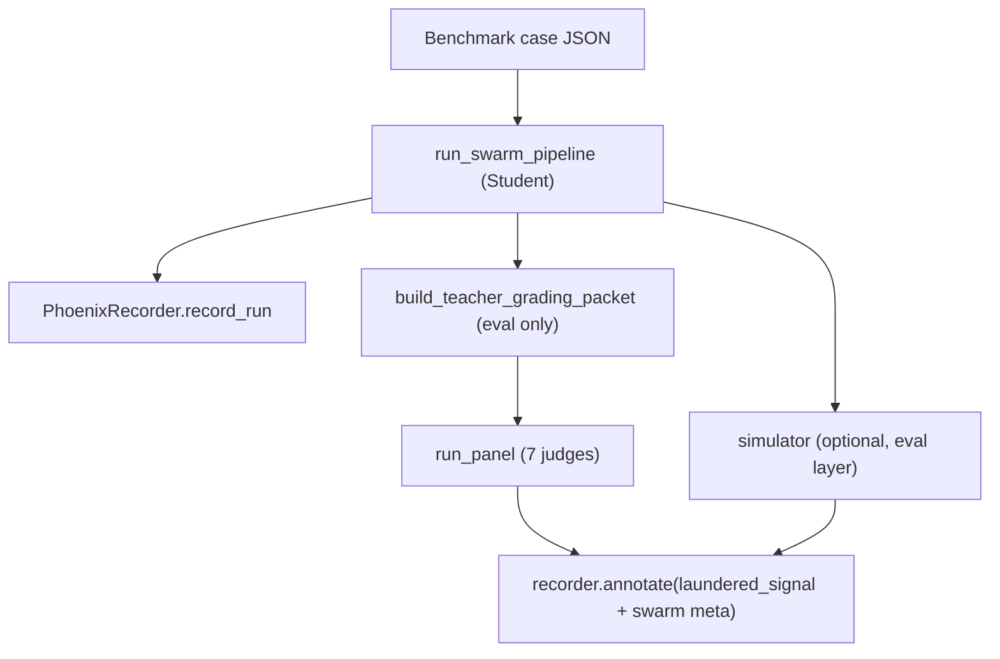

# Phase 5 — Swarm Eval Harness + Phoenix MCP Counterfactual

**Date:** 2026-06-01  
**Status:** Approved for implementation  
**Plan id:** `aegis swarm runtime` (4a2b5ba4), Phase 5 of 7  
**Depends on:** Phases 0–4 complete (`swarm_pipeline`, registry, `agent_trace_signals`, `POST /v1/swarm/appeal`)

---

## Goal

Close the **eval loop** for the Part B swarm: run a benchmark case through the full swarm Student, score it with the **same 7-judge panel** as Part A, record a **firewall-safe** trace annotation, and prove **Phoenix MCP is load-bearing** via an offline-testable MCP-on vs MCP-off counterfactual.

This phase does **not** wire the Learning Coordinator (Phase 6). It does **not** auto-run on user appeals or the consumer frontend.

---

## Non-goals

- Autonomous prompt evolution / promotion (Phase 6)
- New HTTP routes for eval (explicit scripts/tests only)
- Live Gemini judges in unit tests (offline heuristic judges only)
- Changing `POST /v1/swarm/appeal` product behaviour

---

## Architecture (separation of powers preserved)

Mirrors `app/evals/part_a/evaluated_run.py` exactly; only the Student changes from `run_aegis_v1_pipeline` to `run_swarm_pipeline`.

---

## Deliverables

### D1 — `run_evaluated_swarm_case`

**Path:** `backend/app/evals/swarm/evaluated_swarm_run.py`

**Signature (conceptual):**

- Inputs: `case_obj`, `recorder`, optional `SwarmAgentClient`, `JudgeClient`, `CorpusStore`, `phoenix_lookup` callable, `run_simulator`, `simulator_client`
- Output: `EvaluatedSwarmRun` with `appeal_package`, `artifacts`, `panel_report`, `simulator_result`, `trace_ref`

**Steps:**

1. Student: `run_swarm_pipeline(..., run_mode="benchmark", phoenix_lookup=...)`
2. `recorder.record_run(appeal_package, trace_metadata)`
3. Eval: `build_teacher_grading_packet` → `run_panel`
4. Optional simulator (eval layer, not orchestrator)
5. `recorder.annotate` with `laundered_signal` + **firewall-safe swarm summary** (counts, prompt versions, `insurer_phoenix_status` — never raw briefs/letter)

### D2 — Injectable `phoenix_lookup` on pipeline

**Path:** `backend/app/aegis_swarm/swarm_pipeline.py`

Add optional `phoenix_lookup: Callable[[str, str, str], dict] | None` defaulting to `swarm_phoenix_lookup`. Enables counterfactual and tests without mutating `os.environ`.

### D3 — Stub propagates Phoenix → letter quality

**Path:** `backend/app/aegis_swarm/client.py` (`StubSwarmClient.strategize`)

When `InsurerBrief.tactic` is non-empty (Phoenix on / cold-start), embed it in `AppealStrategy.lead_angle.summary` so the drafter letter differs measurably when MCP is disabled (empty tactic). Required for offline counterfactual delta with heuristic judges.

### D4 — `run_swarm_counterfactual`

**Path:** `backend/app/learning/swarm_counterfactual.py`

For each benchmark case:

1. `run_evaluated_swarm_case` with `phoenix_lookup=enabled`
2. Same with `phoenix_lookup=disabled`
3. Compare `composite_score` from panel reports
4. Return aggregate `{on_composite, off_composite, delta, per_case}` + **attribution fields** (`insurer_brief_phoenix_unavailable` on/off)

Reuses `PanelJudgeAdapter` for consistency with Part A learning harness.

### D5 — Tests (TDD)

| File | Asserts |
|---|---|
| `tests/unit/evals/swarm/test_evaluated_swarm_run.py` | Loop closes; annotations have `weighted_quality`; `artifacts.agent_trace_signals` present |
| `tests/unit/evals/swarm/test_swarm_firewall.py` | Answer-key never in recorder annotations |
| `tests/unit/learning/test_swarm_counterfactual.py` | MCP on composite > off; insurer brief flags differ |
| `tests/unit/aegis_swarm/test_swarm_phoenix_injection.py` | Custom `phoenix_lookup` used when passed |

### D6 — Offline script (optional operator tool)

**Path:** `backend/scripts/run_swarm_counterfactual_offline.py`

Loads 2–3 draft cases from `eval/cases/drafts/`, runs counterfactual, prints JSON summary for demo recording.

---

## Firewall / constitution

- **INV-2:** Teacher packet only in eval layer; annotations use `laundered_signal` only; swarm meta is structural (no brief text, no answer-key fields).
- **INV-3:** Simulator verdict in annotations when run.
- **D11:** Simulator not in `run_swarm_pipeline`; optional in eval harness only (same as Part A evaluated run).

---

## Acceptance criteria

- **AC-1:** `uv run pytest tests/unit/evals/swarm tests/unit/learning/test_swarm_counterfactual.py -q` passes with no credentials.
- **AC-2:** `run_swarm_counterfactual` on ≥2 cases shows `delta > 0` with `StubSwarmClient` + `OfflineHeuristicJudgeClient`.
- **AC-3:** MCP-off path sets `phoenix_mcp_unavailable` on insurer brief; MCP-on path does not.
- **AC-4:** Product `POST /v1/swarm/appeal` unchanged (no judge calls added).

---

## Implementation order

1. Pipeline `phoenix_lookup` param + test  
2. Stub strategize tactic propagation  
3. `evaluated_swarm_run.py` + tests + firewall test  
4. `swarm_counterfactual.py` + test  
5. Offline script  
6. Update `docs/memory/current-state.md` (Phase 5 done)

---

## Phase 6 preview (not built here)

Credit map resolution → `SwarmExperimentRunner` → `LearningCoordinator.optimize()` on resolved `component_id`; requires Phase 5 scores in Phoenix store.
