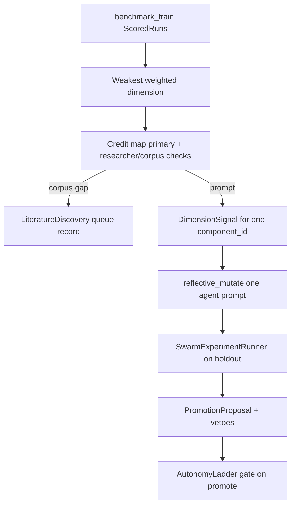

# Phase 6 Plan — Swarm Learning Coordinator + Credit-Map Re-Point

**Date:** 2026-06-02  
**Status:** Approved for implementation  
**Depends on:** Phases 0–5 (swarm runtime, trace signals, `run_evaluated_swarm_case`, credit-assignment map)

## Goal

Close the Part B self-improvement loop: Phoenix (laundered) judge signal → **credit-map resolution** → mutate **one** responsible agent prompt → re-score on holdout → HITL/autonomy-gated promotion.

## PM clarification (non-negotiable)

- **Three weak agents** (`drafter`, `strategist`, `medical_necessity`) are the **starting baselines** for demo headroom — not the only evolvable agents.
- **Every pipeline agent** (`triage`, all researchers, `strategist`, `drafter`, `adversarial_reviewer`) MUST be eligible when the credit map + trace signals attribute the bottleneck to that role.
- `orchestrator` is excluded (no runtime prompt in the walking skeleton). `adversarial_reviewer` remains evolvable under Apprentice/HITL; **Master autonomous rewrite** is forbidden for it (NFR-3 + autonomy design).

## Non-goals (this phase)

- Live Phoenix MCP store (offline `InMemoryPhoenixLearningStore` + stub runner first)
- Cron / background coordinator loop (manual trigger per CL-1)
- Gumloop approval of benchmark-200 (dataset may be partial)
- Playbook evolution (swarm prompt components only; playbooks stay Part A surface for now)

## Architecture

## Deliverables

| # | Module | Responsibility |
|---|--------|----------------|
| 1 | `learning/credit_resolution.py` | Dimension → component; corpus-gap vs researcher override; `EVOLVABLE_AGENT_ROLES` |
| 2 | `learning/swarm_scored_run.py` | `panel_report` + trace signals → `ScoredRun` (firewall-safe) |
| 3 | `learning/swarm_candidate.py` | Seed `Candidate` from registry (`current_version` only) |
| 4 | `learning/swarm_experiment.py` | `SwarmExperimentRunner` Protocol + `StubSwarmExperimentRunner` |
| 5 | `learning/swarm_signal.py` | `acquire_swarm_signal()` — global weakest dim + resolved component |
| 6 | `learning/swarm_coordinator.py` | `SwarmLearningCoordinator.optimize()` / `promote()` |
| 7 | `learning/autonomy_ladder.py` | Apprentice / Journeyman / Master + circuit breaker |
| 8 | `learning/benchmark_dataset.py` | 60/40 train/holdout loader (deterministic; works on drafts subset) |
| 9 | `aegis_swarm/prompt_override_client.py` | Inject candidate prompts into live client |
| 10 | `scripts/run_swarm_learning_offline.py` | Demo CLI |

## Credit resolution rules

1. Compute per-dimension means on train split.
2. Pick **weakest weighted** dimension.
3. Primary owner from credit map (see `credit-assignment-map.md`).
4. If dimension is corpus-gap-plausible AND failing runs' firewall-safe trace signals show researcher `empty`/`partial` with domain empty flags → target that **researcher role** (e.g. `policy_detective` for evidence gaps).
5. Else if corpus-gap-plausible AND aggregate gaps dominate → `corpus_gap` action (queue, no prompt mutation this round).
6. Else → evolve **primary** prompt component (may be any evolvable role, including `triage`, `legal_researcher`, etc.).

## Evolution integrity (unchanged)

- Optimizer seeds ONLY `registry.current_version` per role — never `load_target_reference()`.
- One component mutated per child (V2-INV-2).
- Held-out-only experiment scoring (V2-INV-3).
- INV-1: no Phoenix runs → `optimize()` returns `None`.
- INV-2: firewall on signals and reflection minibatch.

## Autonomy ladder (FR-3)

Implement `AutonomyLadder` per `docs/specs/2026-05-27-autonomy-ladder-design.md`:

| Stage | Promotion |
|-------|-----------|
| Apprentice | HITL only |
| Journeyman | Auto if vetoes empty + thresholds met |
| Master | Auto with relaxed lift; **cannot** auto-promote changes to `adversarial_reviewer` |

Circuit breaker: >10% composite drop over last 10 holdout scores → demote to Journeyman.

## Benchmark (FR-4)

- `load_benchmark_cases(split)` — deterministic 60/40 by sorted `case_id` from `eval/cases/drafts/case_*.json`.
- Tests use a 4-case micro-fixture; full 100-case path works when files exist.

## Tests

| Test file | Asserts |
|-----------|---------|
| `test_credit_resolution.py` | Map routes dimensions; researcher override; corpus gap |
| `test_swarm_signal.py` | Resolved component matches weakest dim |
| `test_swarm_experiment.py` | Stub runner monotone lift on holdout |
| `test_swarm_coordinator.py` | End-to-end proposal; strategist + medical_necessity + legal paths |
| `test_swarm_coordinator_non_weak.py` | `triage` or `insurer_intelligence` can be mutation target |
| `test_autonomy_ladder.py` | Stage transitions + Master blocks adversarial |
| `test_benchmark_dataset.py` | 60/40 split counts |

## Acceptance

- [ ] `SwarmLearningCoordinator.optimize()` returns promotable proposal offline when train signal exists.
- [ ] Mutation target can be **any** `EVOLVABLE_AGENT_ROLES` member per credit map (tested for ≥2 non-weak agents).
- [ ] Corpus-gap path returns recommendation without mutating prompts.
- [ ] All unit tests green; memory docs updated.

## Implementation order

1. Models + credit_resolution + tests  
2. swarm_candidate + swarm_scored_run  
3. swarm_experiment + prompt_override_client  
4. swarm_signal + swarm_coordinator  
5. autonomy_ladder + benchmark_dataset  
6. CLI script + docs/memory  
