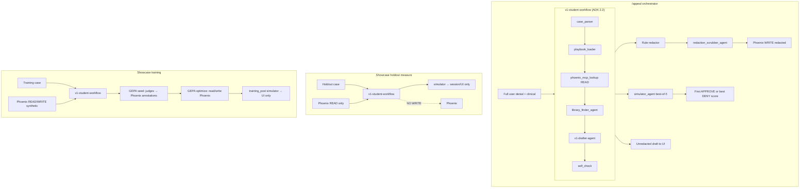

# Plan v2: Make aegis-v1 genuinely built on ADK

- **Status:** Phase 0 **complete** (2026-06-07). Phase 1+ **blocked until PM says "go"**.
- **Orchestration (PM 2026-06-07):** All multi-step ADK graphs use **`google.adk.Workflow`** — not `SequentialAgent`, not `ParallelAgent`. See §3.4 and §12.4.
- **Supersedes:** [2026-06-07-aegis-v1-adk-migration-plan.md](2026-06-07-aegis-v1-adk-migration-plan.md) for all product/architecture decisions. v1 remains useful only for historical API notes.
- **Scope:** `aegis-v1` only (Part A). Swarm / Part B is out of scope.
- **Audience:** Any agent in any harness with **no chat context**. This document is the single source of truth for the ADK migration.
- **Related docs:** [assessment-arize-track.md](../assessment-arize-track.md) (hackathon readiness), [current-state.md](../memory/current-state.md), [agent-handoffs.md](../memory/agent-handoffs.md)

### Executive summary (read this first)

1. **ADK 2.2 `Workflow`** (`from google.adk import Workflow`) replaces hand-rolled `google.genai` + deleted `root_agent`. Student pipeline = `Workflow` graph with `v1-drafter-agent` and `library_finder_agent` as graph nodes; simulator/reflector = single-shot `LlmAgent`s outside the student graph; judge panel = separate `Workflow` with parallel fan-out (firewall).
2. **What GEPA improves:** drafter prompt/playbook — **not** judge prompts. Phoenix holds **judge feedback memory**.
3. **Phoenix writes — three tiers:**
   - **Tier A (seed):** baseline judge annotations before optimize — `memory_eligible=true` — optimize **reads** this.
   - **Tier B (optimize rounds):** each candidate c1, c2, … judged during loop — write to Phoenix for **demo/audit** — `memory_eligible=false` — **does not** feed `/appeal` drafter.
   - **Tier C (final candidate):** after optimize, before PM approval — judge annotations + drafter checkpoint — `memory_eligible=true` — **key learnings** for next `/appeal`.
4. **`/appeal`:** Phoenix **read before** draft (full case text); **write after** draft (redacted copy only); user sees unredacted letter.
5. **Holdout measure:** Phoenix read only, never write. **Simulator:** UI/session only — never Phoenix, never judges.

---

## 0. PM decisions log (authoritative — do not re-litigate silently)

These were decided in a multi-session PM ↔ agent review (2026-06-07). Implementation must follow them.

| # | Decision |
|---|---|
| D1 | **Delete `root_agent`** in [backend/app/aegis_v1/agent.py](../../backend/app/aegis_v1/agent.py). Replace with ADK 2.2 Workflow + `v1-drafter-agent` inside a student workflow graph. |
| D2 | **All LLM surfaces become ADK `LlmAgent`s:** drafter, library finder, simulator, six judges, reflector. |
| D3 | **ADK 2.2 `Workflow` graph** — import `from google.adk import Workflow` (package `google.adk.workflow`). **Not** `SequentialAgent` or `ParallelAgent` (both deprecated in `google.adk.agents`). Verified on `google-adk==2.2.0` — see §12.4. |
| D24 | **Workflow is the v1 orchestration primitive** for every multi-step ADK graph: student pipeline (Phase 1) and judge panel (Phase 3). Single-turn agents (simulator, reflector, redaction scrubber) run via `run_llm_agent_sync` — never as sub-agents of the student `Workflow`. Appeal best-of-5 stays a Python loop calling student `Workflow` + simulator. |
| D4 | **No `AEGIS_USE_ADK` feature flag.** Stash legacy `Gemini*Client` + old `root_agent` code under a `legacy/` or `_stash/` path with a **CLEANUP: delete after ADK path verified** note. Single production path once shipped. |
| D5 | **`gemini_retry` via custom `BaseLlm` wrapper** passed to every `LlmAgent`. Preserves pacing, exponential retry, and `gemini-3.1` → `gemini-3.5-flash` fallback verbatim. |
| D6 | **Firewall (only true non-negotiable):** simulator, judges, and reflector are **never** tools/sub-agents of the student. Drafter **never** receives the teacher packet. |
| D7 | **Student workflow order:** `case_parser` → `playbook_loader` → **`phoenix_mcp_lookup` (READ)** → **`library_finder_agent`** → **`v1-drafter-agent`** → `self_check`. Library runs only after playbook, active prompt version, and Phoenix summary are available. |
| D8 | **`/appeal` drafter MUST read Phoenix before drafting** (`phoenix_mcp_lookup`). Then draft with full patient/clinical detail. **After** draft: redacted copy written to Phoenix. User sees **unredacted** letter. |
| D9 | **Holdout measure-only paths:** Phoenix **read only, never write** (pre + post holdout). Prevents polluting training/post-training with holdout case signal. |
| D10 | **Training cases (synthetic):** drafter may **read + write** Phoenix. **No redaction** on synthetic training data. Two explicit drafter write checkpoints: **before GEPA optimize** and **after GEPA optimize** (final candidate prompt/playbook). |
| D11 | **GEPA optimize** **reads and writes** Phoenix (three tiers §8.3). **Reads** tier A seed for `acquire_signal`. **Writes** tier B per candidate during rounds + tier C final candidate before approval. **Judges do not improve** — **drafter prompt/playbook** improves from judge feedback. |
| D12 | **Simulator scores NEVER written to Phoenix** — UI and session ledger only. Remove existing paths that attach `simulator_verdict` / `simulator_score` to Phoenix annotations. |
| D13 | **Simulator results NEVER exposed to judges** — not in judge prompts, not in judge context, not in Phoenix annotations that judges or reflection consume. |
| D14 | **`/appeal` best-of-5:** student → simulator loop, max 5 attempts. Return **first APPROVE**; if all DENY, return **highest simulator score** among five. |
| D15 | **PM approval (showcase):** driven by **simulator** green/red on `training_pre` vs `training_post` UI matrix — not by re-reading judge composites. Proposal object still carries judge audit data. |
| D16 | **GEPA seed (tier A):** judge annotations on training cases written to Phoenix (`run_simulator=False`, `memory_eligible=true`). **Not** the full SkillOpt loop. |
| D17 | **Judges verbosity:** slight bias toward verbose `reasoning` / `improvement` for learning and unfamiliar-case benefit; cap length in prompts to avoid context bloat. |
| D18 | **Six separate judge `LlmAgent`s** (not one panel agent) for Phoenix demo richness. Deterministic gates stay Python. |
| D19 | **Redaction:** rule-based pass + LLM scrubber agent on **Phoenix export copy only** (`/appeal` path). Must strip identifiers but **preserve clinical facts**. **No redaction** on synthetic training data. |
| D20 | **Serious-run MCP A/B counterfactual UI:** **back burner** — do not implement until PM reopens. |
| D21 | **Integration seam:** thin dispatcher in [pipeline.py](../../backend/app/aegis_v1/pipeline.py) calling `run_aegis_v1_adk_pipeline(...)` with same injection parameters as today. |
| D22 | **Many red simulator boxes after training can be correct** — honest demo behavior; GEPA optimizes judge signal, not simulator approval. |
| D23 | **`aegis.memory_eligible` on Phoenix spans:** only `true` spans feed `phoenix_mcp_lookup` → drafter. Tier B optimize rounds use `false`. Tier A seed, tier C final candidate, promoted, and `/appeal` use `true` (holdout stays read-only). |

---

## 1. Why this work exists

### 1.1 Current state (verified 2026-06-07)

ADK is used for:
1. FastAPI via `get_fast_api_app(...)` in [main_v1.py](../../backend/app/main_v1.py)
2. A sidelined `root_agent` in [agent.py](../../backend/app/aegis_v1/agent.py) (playground only)

**Product paths bypass ADK for all LLM calls:**

| Role | Implementation today |
|---|---|
| Drafter | `GeminiDrafterClient` → raw `google.genai` |
| Simulator | `GeminiSimulatorClient` → raw `google.genai` |
| Judges (×6) | `GeminiJudgeClient` → raw `google.genai` |
| Reflector | `GeminiReflectionClient` → raw `google.genai` |

All route through [gemini_retry.py](../../backend/app/gemini_retry.py).

`/appeal` ([appeal_orchestrator.py](../../backend/app/aegis_v1/appeal_orchestrator.py)) and `/showcase` measurement ([measurement_run.py](../../backend/app/evals/part_a/measurement_run.py)) call `run_aegis_v1_pipeline` — **never** the ADK `root_agent`.

### 1.2 Why `root_agent` was sidelined

`root_agent` sets **both** `output_schema=AppealPackage` **and** `tools=[...]`. ADK disallows reliable tool use with `output_schema` on `LlmAgent`. v2 **deletes** this pattern.

### 1.3 Consequences if unfixed

- "Built on ADK" is true only at the web-framework level
- OpenInference ADK instrumentor does not trace raw `google.genai` LLM spans
- Hackathon tracing story is thinner than it appears ([assessment-arize-track.md](../assessment-arize-track.md))

---

## 2. What is NOT a non-negotiable

**Fixed step order** is a **design choice** with real dependencies, not dogma. The PM-chosen order (D7) replaces the old `case_parser → corpus_retrieval → phoenix → playbook → drafter` order from v1 pipeline.

**Reproducible A/B** remains required for showcase (prompt/playbook injection seams) but is implemented via workflow inputs (`drafter_prompt_text`, `playbook_override`, `drafter_prompt_version`) — not by preserving the old pipeline file layout.

---

## 3. Target architecture

### 3.1 Agent inventory

| Agent | Type | Invoked by | In student workflow? |
|---|---|---|---|
| `v1-student-workflow` | `google.adk.Workflow` root graph | `run_aegis_v1_adk_pipeline` | — |
| `case_parser` step | `@node` `FunctionNode` (Python) | student `Workflow` graph | Yes |
| `playbook_loader` step | `@node` `FunctionNode` | student `Workflow` graph | Yes |
| `phoenix_mcp_lookup` step | `@node` `FunctionNode` (MCP read + `_summarize_traces`) | student `Workflow` graph | Yes |
| `library_finder_agent` | `LlmAgent` **as workflow graph node** | student `Workflow` graph | Yes |
| `v1-drafter-agent` | `LlmAgent` **as workflow graph node** | student `Workflow` graph | Yes |
| `self_check` step | `@node` `FunctionNode` | student `Workflow` graph | Yes |
| `judge-panel-workflow` | `google.adk.Workflow` (parallel fan-out) | `run_panel` / eval layer only | **No** |
| `judge_*` (×6) | `LlmAgent` nodes inside judge `Workflow` | eval layer only | **No** |
| `simulator_agent` | `LlmAgent` (single-shot) | appeal orchestrator only | **No** |
| `reflector_agent` | `LlmAgent` (single-shot) | learning coordinator only | **No** |
| `redaction_scrubber_agent` | `LlmAgent` (single-shot) | post-draft export only (`/appeal`) | **No** |

### 3.2 High-level diagram



### 3.4 Workflow usage policy (D3, D24)

**Import path (authoritative — `google-adk==2.2.0`):**

```python
from google.adk import Workflow          # re-export from google.adk.workflow
from google.adk.workflow import node, START, Edge
from google.adk.agents import LlmAgent
from google.adk.apps import App
```

**Do not use:** `google.adk.agents.workflow` (does not exist), `SequentialAgent`, `ParallelAgent`.

| Surface | Pattern | Module (planned) | Why |
|---|---|---|---|
| **Student pipeline** | `Workflow` + `state_schema` + linear `edges` chain | `student_workflow.py` | Plan D7; replaces imperative `pipeline.py` orchestration |
| **Judge panel** | `Workflow` with fan-out for five quality judges after Python prechecks | `judge_workflow.py` (or `judge_agents.py`) | Parallel grading without deprecated `ParallelAgent` |
| **Simulator** | Single `LlmAgent` via `run_llm_agent_sync` | `simulator_agent.py` | One-shot scoring; firewall — not in student graph |
| **Reflector** | Single `LlmAgent` via `run_llm_agent_sync` | `reflection_agent.py` | One-shot mutation proposal; firewall |
| **Redaction scrubber** | Single `LlmAgent` via `run_llm_agent_sync` | `redaction_scrubber_agent.py` | Post-draft export only; not in student graph |
| **`/appeal` best-of-5** | Python loop: `run_workflow_sync(student)` → `run_llm_agent_sync(simulator)` | `appeal_orchestrator.py` | Firewall + simple retry cap (D14) |
| **Dev / FastAPI `App`** | `App(root_agent=v1_student_workflow)` — `Workflow` is a valid `BaseNode` root | `agent.py` | ADK `App` validator accepts `BaseNode` including `Workflow` |

**Student graph sketch (Phase 1):**

```python
from google.adk import Workflow
from google.adk.workflow import START

v1_student_workflow = Workflow(
    name="v1_student_workflow",
    state_schema=StudentWorkflowState,
    edges=[
        (
            START,
            case_parser_node,
            playbook_loader_node,
            phoenix_read_node,
            library_finder_agent,
            v1_drafter_agent,
            self_check_node,
        ),
    ],
)
```

- Deterministic steps: `@node`-decorated functions → `FunctionNode` (bind params from `ctx.state` via `state_schema`).
- LLM steps: `LlmAgent` instances passed directly in `edges` — ADK wraps them as graph nodes (`build_node` sets `mode='single_turn'`).
- **`mode='task'` LlmAgents cannot be static workflow graph nodes** (ADK 2.2.0 validation) — use `single_turn` / `chat` only.

**Judge panel sketch (Phase 3):**

```python
judge_panel_workflow = Workflow(
    name="judge_panel_workflow",
    state_schema=JudgePanelState,
    edges=[
        (START, citation_precheck_node, safety_scope_gate_node),
        # Fan-out: five quality judges run in parallel, then join
        (safety_scope_gate_node, (judge_legal_node, judge_medical_node, ...)),
        (join_panel_results_node, aggregate_panel_node),
    ],
)
```

Exact fan-out/join syntax to match installed ADK `edges` tuple rules during Phase 3 spike.

**Verified API notes:** [backend/app/aegis_v1/ADK_API_NOTES.md](../../backend/app/aegis_v1/ADK_API_NOTES.md) (Phase 0).

### 3.5 Student vs teacher packets (who builds them)

| Packet | Builder | Module | Consumers | Student sees it? |
|---|---|---|---|---|
| **Student case packet** | `build_student_case_packet()` | [teacher_packet.py](../../backend/app/evals/part_a/teacher_packet.py) | Could formalize at API ingress; today inputs flow via `case_parser` | Inputs only (denial + clinical) — **not** the full `StudentCasePacket` object inside workflow state unless refactored |
| **Teacher grading packet** | `build_teacher_grading_packet()` | same | `run_panel` / judges only | **Never** |

`/appeal` **never** builds a teacher packet — real users have no answer key.

---

## 4. Drafter resources at draft time

When `v1-drafter-agent` runs, the workflow must assemble this context (full detail for `/appeal`; synthetic full detail for training):

| Resource | Source step | Notes |
|---|---|---|
| **System prompt** | Active `drafter_vN.md` or `drafter_prompt_text` override | Includes disclaimer, safety rules, weak-v1 baseline tone |
| **Playbook** | `playbook_loader` or `playbook_override` | Per insurer × denial_type tactics |
| **Phoenix summary** | `phoenix_mcp_lookup` (**READ before draft — required on `/appeal`**) | Laundered judge feedback from `memory_eligible=true` spans only (D23): `failure_patterns`, `success_traits`, `similar_trace_count` — **not** raw past letters, **not** tier B experiment traces |
| **Parsed case** | `case_parser` | Insurer, denial_type, plan_type, state, case_id, **denial_text**, **clinical_context** |
| **Library citations** | `library_finder_agent` | Quotes, corpus doc IDs, titles |
| **Library metadata** | Search planner / prep layer | Query string, availability flags, discovery metadata → risk flags |
| **Merged risk flags** | Prior steps | e.g. `library_unavailable`, `phoenix_mcp_cold_start` |

**Explicitly blocked from drafter (firewall):**

- Teacher packet / expected appeal vectors / exploitable weaknesses
- Simulator verdict or score
- Judge scores / panel report
- Raw Phoenix trace letter text

---

## 5. Phoenix modes matrix

Context is passed into `run_aegis_v1_adk_pipeline(..., phoenix_mode=...)` (exact enum name TBD in implementation).

| Context | READ before draft? | WRITE after draft? | Redaction on write? | What gets written |
|---|---|---|---|---|
| **`/appeal`** | **Yes (required)** | Yes | **Yes** (rule + scrubber) | Redacted ADK spans + app recorder metadata |
| **Showcase holdout measure** (`pre`, `post`) | Yes | **No** | N/A | Nothing from drafter |
| **Showcase training — checkpoint 1** (before GEPA optimize) | Yes | Yes | No (synthetic) | Baseline training drafter trace |
| **Showcase training — GEPA seed** | Via store reads | Judge annotations only | N/A (laundered judge signal) | `laundered_signal()` — **no simulator fields** |
| **Showcase training — GEPA optimize (each round)** | Yes (`acquire_signal`) | Yes — **per candidate judged** | No (synthetic) | Judge annotations tagged `memory_eligible=false` + `candidate_id` (§8.4) |
| **Showcase training — post-optimize candidate** | Yes | Yes | No (synthetic) | Final candidate judge annotations + drafter trace; `memory_eligible=true` (§8.5) |
| **Showcase training — checkpoint 2** (after GEPA, candidate prompt) | Yes | Yes | No (synthetic) | Post-optimize training drafter trace |
| **Showcase training measure** (`training_pre`, `training_post`) | Yes (in pipeline) | **No** from measure path | N/A | Simulator → session JSON only |

### 5.1 Who makes the Phoenix summary?

**Not Phoenix Cloud's LLM.** Flow:

1. MCP fetches spans + annotations ([phoenix_mcp.py](../../backend/app/aegis_v1/phoenix_mcp.py)) — **v2: filter to `aegis.memory_eligible=true` only** (D23)
2. [`_summarize_traces()`](../../backend/app/aegis_v1/tools.py) — **pure Python** — extracts judge dimension scores/improvements into `failure_patterns` / `success_traits`

Phoenix summary = compressed **judge critiques** from approved/seed/final-candidate/`/appeal` memory — not optimize-round experiments (tier B).

This is **runtime memory introspection**, separate from the hackathon **eval** requirement (see §5.2).

### 5.2 Hackathon eval requirement (not disqualified)

Track requires: *"Run evaluations on your traces with LLM-as-a-Judge or code evals."*

**Satisfied by your code**, not Phoenix UI judges:
- `GeminiJudgeClient` + `run_panel` → `OtelPhoenixRecorder.annotate()` writes judge scores to traces
- Deterministic code gates (`safety_scope_gate`, `citation_precheck`)

Using your own Gemini judges **in code** is the intended pattern for a "code-owned runtime."

---

## 6. Redaction pipeline (`/appeal` only)

**Wrong (do not implement):** redact before drafting.

**Correct flow:**

1. User submits full denial + clinical context
2. Student workflow runs with **full text** (Phoenix READ → … → draft)
3. **User UI** receives **unredacted** `appeal_letter`
4. **Parallel export path** for Phoenix:
   - Rule-based redactor (names, DOB, MRN, member ID, address patterns)
   - `redaction_scrubber_agent` catches rule misses
   - **Constraint:** strip identifiers, **do not remove clinical facts** required for downstream learning
5. Redacted copy → Phoenix WRITE

**Training / synthetic:** skip redaction entirely (D10).

---

## 7. Simulator behavior

### 7.1 Roles by surface

| Surface | Simulator role | Written to Phoenix? | Visible to judges? |
|---|---|---|---|
| `/appeal` | **Gatekeeper** (best-of-5, D14) | **Never** | **Never** |
| Showcase holdout UI matrix | Independent quality metric (blind insurer persona) | **Never** | **Never** |
| Showcase training UI matrix | PM approval visual (`training_pre` vs `training_post`) | **Never** | **Never** |
| GEPA seed | **Off** (`run_simulator=False`) | **Never** | **Never** |
| GEPA optimize internal scoring | **Off** — judges only | **Judge annotations yes** (not simulator; §8.4) | **Never** |

### 7.2 `/appeal` best-of-5 (D14)

```
for attempt in 1..5:
    draft = run_student_workflow(...)
    outcome = simulator_agent(draft)
    if outcome.verdict == APPROVE:
        return draft, outcome  # first APPROVE wins
return draft_with_highest_simulator_score, outcome
```

Cap at 5. Show progress in UI if time permits.

### 7.3 Code changes required (simulator firewall)

Remove or guard these leak paths:

| File | Issue |
|---|---|
| [evaluated_run.py](../../backend/app/evals/part_a/evaluated_run.py) L68–70 | Stops writing `simulator_verdict` / `simulator_score` to `recorder.annotate()` |
| [phoenix_live.py](../../backend/app/learning/phoenix_live.py) | Stop reading `simulator_verdict` from Phoenix into `ScoredRun` |
| [experiment.py](../../backend/app/learning/experiment.py) L79 | Remove `simulator_verdict` from `CaseScore` in live runner |
| [judge_adapter.py](../../backend/app/learning/judge_adapter.py) L17 | Remove `simulator_verdict` parameter entirely |
| [gates.py](../../backend/app/learning/gates.py) L28–29 | Remove or replace `simulator_approve_but_judges_fail` veto if simulator never in experiment path |

---

## 8. GEPA: seed vs optimize (plain English)

### 8.1 GEPA seed (`_seed_training_signal` in [showcase_runner.py](../../backend/app/aegis_v1/showcase_runner.py))

**What it is:** Step zero — **populate Phoenix with judge feedback** on training cases so the optimizer has a gradient.

**What it is NOT:** The full SkillOpt/GEPA reflective loop.

**Per training case:**
1. `run_evaluated_case(..., run_simulator=False)`
2. Student drafts → `recorder.record_run` (metadata span)
3. Judges run → `recorder.annotate(laundered_signal)` — **judge only, no simulator**

### 8.2 GEPA optimize (`LearningCoordinator.optimize()` in [coordinator.py](../../backend/app/learning/coordinator.py))

**What it is:** The actual SkillOpt/GEPA reflective loop (not the seed step).

#### What improves (wording — do not confuse)

| Actor | Improves during GEPA? | Role |
|---|---|---|
| **Judge prompts** | **No** — frozen | Fixed graders; same rubric every round |
| **Judge feedback in Phoenix** | **Accumulates** | *"Here is what the judges said was weak/strong"* — laundered annotations |
| **Drafter prompt + playbook** | **Yes** — this is what GEPA mutates | Reflector edits based on judge feedback |
| **Future `/appeal` drafter** | **Indirectly yes** | Reads Phoenix summary of past judge feedback (`phoenix_mcp_lookup`) before drafting |

Phoenix is **not** "the judges getting smarter." Phoenix is **memory of judge critiques** that the **reflector** and **future drafters** use.

**Loop steps:**

1. `acquire_signal()` — **reads** judge annotations from Phoenix (train `dataset_split`)
2. `reflective_mutate()` — reflector proposes prompt/playbook edit
3. `LiveExperimentRunner.run(candidate)` — re-drafts training cases with candidate components, re-judges
4. Pareto select, merge, repeat up to `max_rounds`
5. Returns `PromotionProposal` (`before` / `after` judge composites, deltas, vetoes)

**Showcase quirk (preserve unless PM changes):** `_optimize()` passes `holdout_split=train_split` — candidate scoring runs on the **training cohort**, not the holdout cohort. Holdout is for simulator pre/post UI matrix only.

### 8.3 Is it helpful to send GEPA optimize-round data to Phoenix? (PM question)

**Short answer: Yes — helpful for demo, observability, and audit. Required for the product story; not strictly required for the math of a single optimize pass.**

Three tiers of Phoenix writes — do not treat them as equally important:

| Tier | When | Required for loop to run? | Required for `/appeal` drafter memory? | Required for hackathon demo? |
|---|---|---|---|---|
| **A — Seed** | Before optimize (`train_gepa`) | **Yes** — `acquire_signal()` reads this | Seeds slice memory | Yes |
| **B — Optimize rounds** | Each candidate c1, c2, … during loop | **No** — today runs in-memory; loop still works | **No** — tagged `memory_eligible=false` | **Yes** — shows optimization arc in Phoenix UI |
| **C — Final candidate** | After optimize, before approval (§8.5) | No | **Yes** — key learnings for proposed prompt | Yes |

**Why tier B (optimize rounds) is still worth doing:**

- Judges see each candidate prompt tried → traces in Phoenix = *"self-improving agent"* demo evidence
- PM/engineer can debug why c2 beat c1 without re-running
- Hackathon judges can click through candidate lineage in Phoenix Cloud
- Aligns with track bonus: *"uses observability data to improve over time"* — the improvement **process** is visible, not just the outcome

**Why tier B must NOT feed the runtime drafter directly:**

- Intermediate candidates are **experiments** — many are worse than baseline
- If `phoenix_mcp_lookup` summarized all of them into `failure_patterns`, `/appeal` would inherit noise from rejected prompts
- **D23 fix:** write optimize rounds to Phoenix with `memory_eligible=false`; only tier A + C (+ promoted/`/appeal`) use `memory_eligible=true`

**Does the reflector need tier B in Phoenix?**

- **Minimum:** reflector reads tier A (seed annotations) via `acquire_signal()` — enough to propose first edit
- **Within a single optimize session:** round-to-round scoring uses **in-memory** `ExperimentResult` (today's pattern) — does not require tier B
- **Optional later:** `acquire_signal()` could include tier B spans for richer cross-round signal — only if filtered to failing cases; not required for v2 MVP

### 8.3b Does GEPA optimize write to Phoenix **during** rounds? (implementation)

**Today (pre-migration): NO.** `LiveExperimentRunner.run()` scores candidates **in memory only**. Judge results from intermediate candidates (c1, c2, merged, …) are **not** persisted to Phoenix. Only **GEPA seed** (baseline) annotations are in Phoenix when optimize starts.

**v2 (required): YES — tier B — each judged candidate during optimize writes to Phoenix.**

When the optimizer evaluates a candidate prompt/playbook version:

1. For each training case (or minibatch): student drafts with that candidate
2. Judges run → laundered annotations
3. **`recorder.record_run` + `recorder.annotate`** persist to Phoenix (same as seed path)
4. Span metadata must include:
   - `aegis.dataset_split` = session train split (e.g. `showcase_quick_train_{session_id}`)
   - `aegis.candidate_id` = e.g. `seed`, `c1`, `c2`, `m3`
   - `aegis.gepa_round` = round index
   - `aegis.prompt_version` / `aegis.playbook_version` = candidate versions
   - `aegis.memory_eligible` = **`false`** for intermediate candidates (D23)
   - `aegis.run_mode` = `gepa_optimize_candidate`

**Why write during rounds:**

- Phoenix UI shows the optimization story (traces per candidate) — load-bearing for hackathon demo
- `acquire_signal()` on later rounds can see richer train-split history (optional; implementer may filter to seed+failing cases if noise becomes a problem)
- Aligns with PM expectation: *"different prompt/playbook versions are being tried and judged — that should land in Phoenix"*

**Why `memory_eligible=false` on intermediate candidates:**

`phoenix_mcp_lookup` filters by insurer/denial_type slice today — **not** by dataset_split. If every failed candidate's judge notes were summarized into `failure_patterns`, the **runtime drafter** would ingest experimental noise. D23 prevents that:

- **Experiment traces** → visible in Phoenix for humans/demo
- **Runtime memory** → only `memory_eligible=true` spans feed `_summarize_traces` → drafter

**Implementation note:** extend `_slice_filter` / MCP fetch to require `aegis.memory_eligible != false` (default true for backward compat on legacy spans).

### 8.4 GEPA optimize Phoenix write policy (summary table)

| When | Phoenix WRITE? | What is written | `memory_eligible` | Consumed by `phoenix_mcp_lookup`? |
|---|---|---|---|---|
| GEPA seed (baseline prompt) | Yes | Judge annotations per training case | `true` | Yes (after filter) |
| Each optimize round (candidate cN) | **Yes (v2)** | Judge annotations for that candidate on training cases | `false` | **No** |
| Post-optimize final candidate (§8.5) | Yes | Judge annotations + drafter checkpoint trace | `true` | Yes |
| On PM approve (`register_promotion`) | Yes | Prompt/playbook versions to disk + Phoenix Prompts registry | N/A (registry) | Indirect (new prompt loads) |
| `/appeal` production draft | Yes (redacted) | ADK spans + app recorder | `true` | Yes (future runs) |

**Simulator:** still **never** written in any row (D12).

### 8.5 Post-optimize candidate write (end of training — PM priority)

**Gap today:** after optimize returns `PromotionProposal`, only `training_post` **simulator** measure runs — **candidate judge feedback is not written to Phoenix** before `needs_approval`.

**v2 required — before `mark_needs_approval`:**

1. Run **`run_evaluated_case`** (or equivalent) on training cases with **final candidate** prompt/playbook from `PromotionProposal`
2. Write judge laundered annotations to Phoenix with `memory_eligible=true`, `run_mode=training_checkpoint_post_gepa`
3. Run drafter Phoenix write checkpoint B (D10) — synthetic, full detail

This is where **key learnings for the proposed prompt** are captured for:

- Future `/appeal` drafters (via `phoenix_mcp_lookup` READ)
- PM audit alongside simulator green/red matrix
- Demo narrative: *"here is what judges said about the prompt you're being asked to approve"*

**Distinct from GEPA seed:** seed = baseline/old prompt. §8.5 = **candidate/new prompt** — both must exist in Phoenix before approval.

### 8.6 PM approval (D15)

When session reaches `needs_approval`:

- **Primary PM decision:** compare `training_pre_measure_results` vs `training_post_measure_results` simulator APPROVE/DENY counts (green/red boxes)
- **Secondary audit:** `PromotionProposal` judge composites, vetoes, diff summary
- **Honest UX:** many reds after training is valid if judges improved but simulator still DENYs (D22)

---

## 9. Showcase session flow (end-to-end)

Current orchestration in `_run_learning_session` — ADK migration must preserve this shape:

| Stage | Phase key | Cases | Simulator? | Phoenix write? | Purpose |
|---|---|---|---|---|---|
| Holdout pre-measure | `pre` | holdout | Yes → UI | **No** | Baseline holdout matrix |
| Training pre-measure | `training_pre` | train | Yes → UI | **No** | Baseline training matrix (PM approval visual) |
| GEPA seed | `train_gepa` | train | **No** | Judge annotations | Learning signal in Phoenix |
| GEPA optimize | (internal) | train | **No** | **Yes — judge annotations per candidate round** (`memory_eligible=false`) | Produce `PromotionProposal` |
| Post-optimize candidate eval | `train_gepa_candidate` (new) | train | **No** | **Yes — judge annotations** (`memory_eligible=true`) | Capture key learnings before approval (§8.5) |
| Training post-measure | `training_post` | train | Yes → UI (candidate prompt) | **No** | Post-training matrix (PM approval visual) |
| `needs_approval` | — | — | — | — | PM accepts/rejects |
| Post-approve holdout | `post` | holdout | Yes → UI | **No** | Regression check vs `pre` |

**New with v2 (D10):** explicit drafter Phoenix writes on training at:
- **Checkpoint A:** after `training_pre`, before GEPA seed (baseline prompt/playbook)
- **Checkpoint B:** after GEPA optimize, when candidate prompt/playbook finalized (may align with start of `training_post`)

Holdout drafter: **read only, never write** throughout.

---

## 10. Judges

### 10.1 Architecture (D18, D24)

- Six separate `LlmAgent`s — one per rubric dimension in [panel.py](../../backend/app/evals/part_a/panel.py) `JUDGE_IDS`
- Orchestrated by **`judge-panel-workflow`** (`google.adk.Workflow`) — fan-out for five quality judges after deterministic prechecks; **not** deprecated `ParallelAgent`
- `safety_scope_gate` and `citation_precheck` remain **Python `@node` steps** at the front of the judge `Workflow` — not LLM agents
- Each judge `LlmAgent` uses `model=make_retry_model()` and runs as a workflow graph node (§3.4)

### 10.2 Verbosity (D17)

Update judge prompts to request:
- Concrete `reasoning` (what worked / failed)
- Actionable `improvement` lines (feeds Phoenix summary + reflection)

Add soft caps (e.g. max 3 improvement bullets, max N chars) to prevent context rot.

### 10.3 Judge context (firewall)

`run_panel` context today: `appeal_package`, `teacher_packet`, `deterministic_results` only.

**Must never add:** `simulator_verdict`, `simulator_score`, or any simulator output.

---

## 11. `gemini_retry` re-homing (D5)

### 11.1 Why an agent cannot "just retry"

ADK agents do not automatically retry on 429/5xx or fall back when `gemini-3.1-pro-preview` 404s. Without a transport-layer wrapper, serious runs will hit rate limits and model availability failures.

### 11.2 Implementation

Create `RetryFallbackLlm` (name TBD) in [adk_runtime.py](../../backend/app/aegis_v1/adk_runtime.py):

- Subclass/wrap ADK `BaseLlm`
- Delegate `generate` to existing `generate_content_with_fallback` in [gemini_retry.py](../../backend/app/gemini_retry.py)
- Pass one shared instance to every `LlmAgent` via `model=make_retry_model()`

### 11.3 Tests

Mirror existing `gemini_retry` tests:
- Pacing invoked
- Simulated 404 triggers flash fallback
- Transient error retried

---

## 12. ADK runtime helpers

### 12.1 Module: `backend/app/aegis_v1/adk_runtime.py`

Exports (Phase 0 landed; Phase 1 adds `run_workflow_sync`):

| Export | Status | Purpose |
|---|---|---|
| `make_retry_model()` → `RetryFallbackGemini` | ✅ Phase 0 | Custom `BaseLlm` with `gemini_retry` pacing/fallback (D5) |
| `RetryFallbackLlm` | ✅ Phase 0 | Alias for `RetryFallbackGemini` |
| `EchoLlm` | ✅ Phase 0 | Fake model for offline tests |
| `run_llm_agent_sync(agent, ...)` | ✅ Phase 0 | Single-shot `LlmAgent` smoke (simulator, reflector, scrubber) |
| `run_workflow_sync(workflow, *, app_name, initial_state, phoenix_mode)` | Phase 1 | Run `google.adk.Workflow` to completion; return final state + `AppealPackage` inputs |

### 12.2 Async/sync bridge

FastAPI + showcase daemon threads are sync. `Runner.run` is a **sync generator** of `Event` objects. For `Workflow` roots, `Runner` dispatches via `DynamicNodeScheduler` + `NodeRunner` (see `google.adk.runners`).

`run_workflow_sync` should:

1. `InMemorySessionService.create_session_sync(..., state=initial_state)`
2. `Runner(agent=workflow, ...)` — `Workflow` is valid `App.root_agent` / runner root (`BaseNode`)
3. `list(runner.run(...))` → collect events
4. `get_session_sync` → read final `state` for `AppealPackage` assembly

Use `run_llm_agent_sync` only for agents **outside** a `Workflow` graph.

### 12.3 API verification (Phase 0 gate) — **PASS**

Verified against **`google-adk==2.2.0`** (2026-06-07). Full notes: [ADK_API_NOTES.md](../../backend/app/aegis_v1/ADK_API_NOTES.md).

| Check | Result |
|---|---|
| `from google.adk import Workflow` | ✅ |
| `google.adk.agents.workflow` | ❌ does not exist (wrong path) |
| `SequentialAgent` | ⚠️ exists, **deprecated** — do not use |
| `ParallelAgent` | ⚠️ exists, **deprecated** — do not use |
| `Workflow` as `App.root_agent` | ✅ `BaseNode` accepted by `App` validator |
| `LlmAgent` as workflow graph node | ✅ via `build_node` in `google.adk.workflow` |
| `@node` / `FunctionNode` for Python steps | ✅ |
| `Runner.run` + `create_session_sync` | ✅ sync API confirmed |

### 12.4 Workflow API quick reference (D3, D24)

**Package:** `google.adk.workflow` — re-exported as `google.adk.Workflow`.

**Core types:**

| Symbol | Module | Role |
|---|---|---|
| `Workflow` | `google.adk.workflow._workflow` | Root graph orchestrator (`BaseNode`) |
| `node` | `google.adk.workflow._node` | Decorator: Python callable → `FunctionNode` |
| `START` | `google.adk.workflow._base_node` | Graph entry keyword |
| `Edge` | `google.adk.workflow._graph` | Explicit edge object (optional; tuple chains preferred) |
| `FunctionNode` | `google.adk.workflow._function_node` | Wraps sync/async Python; params bind from `state_schema` |
| `LlmAgent` | `google.adk.agents.llm_agent` | Pass directly in `edges` — auto-wrapped as graph node |

**Graph definition:** `edges` is a list of tuples. First row starts with `START`, then nodes in execution order. Conditional routing uses dict syntax: `(router_node, {"route_a": target_a, "route_b": target_b})`. Parallel fan-out uses tuples: `(source, (node_a, node_b))`.

**State:** declare `state_schema: type[BaseModel]` on `Workflow`. Function nodes read/write shared state via `ctx.state` / `Event(state={...})`.

**Docs:** [ADK graph routes](https://adk.dev/graphs/routes/) · [ADK data handling](https://adk.dev/workflows/data-handling/) (official; verify against installed version during Phase 1 spike).

---

## 13. Integration seam (D21)

### 13.1 Primary entrypoint

[pipeline.py](../../backend/app/aegis_v1/pipeline.py):

```python
def run_aegis_v1_pipeline(...) -> dict:
    return run_aegis_v1_adk_pipeline(...)
```

`run_aegis_v1_adk_pipeline` accepts **all existing injection parameters:**
- `drafter_prompt_version`, `drafter_prompt_text`, `playbook_override`
- `drafter_client` → maps to fake model in tests only (stashed legacy client for reference)
- `library_stack`
- `use_phoenix_memory` / new `phoenix_mode` enum
- `dataset_split`, `run_mode`

### 13.2 Callers (unchanged signatures)

| Caller | Path |
|---|---|
| `/appeal` | [appeal_orchestrator.py](../../backend/app/aegis_v1/appeal_orchestrator.py) |
| Showcase measure | [measurement_run.py](../../backend/app/evals/part_a/measurement_run.py) |
| GEPA seed / eval | [evaluated_run.py](../../backend/app/evals/part_a/evaluated_run.py) |
| Learning experiment | [experiment.py](../../backend/app/learning/experiment.py) via drafter |

### 13.3 Legacy stash (D4)

Move to `backend/app/aegis_v1/_stash/` (or similar):
- `GeminiDrafterClient`, `GeminiSimulatorClient`, old `root_agent` definition
- Add `README.md`: *"Stashed pre-ADK clients. DELETE after ADK path live-verified."*

Keep **stubs** (`StubDrafterClient`, `StubSimulatorClient`, `OfflineHeuristicJudgeClient`, `StubReflectionClient`) in place for offline tests — wire to fake ADK model, not stashed Gemini clients.

---

## 14. Phoenix / OpenTelemetry

| Setting | Value |
|---|---|
| Phoenix project (v1) | `default` (set in [main_v1.py](../../backend/app/main_v1.py)) |
| Instrumentor | `openinference-instrumentation-google-adk` |
| Content capture | `OTEL_INSTRUMENTATION_GENAI_CAPTURE_MESSAGE_CONTENT=true` — safe for `/appeal` **only because** Phoenix writes use redacted export path; holdout uses no-write mode |

After ADK migration, LLM spans should appear in Phoenix for ADK agent calls. App-level `OtelPhoenixRecorder` spans remain for eval metadata.

---

## 15. Phase-by-phase implementation

**Gate:** Phase 0 **complete** (2026-06-07). Phase 1+ blocked until PM **"go"**.

### Phase 0 — Foundations ✅

- [x] Verify ADK 2.2 `Workflow` API — `from google.adk import Workflow` (§12.3–12.4; [ADK_API_NOTES.md](../../backend/app/aegis_v1/ADK_API_NOTES.md))
- [x] Implement `adk_runtime.py` + `RetryFallbackGemini` / `RetryFallbackLlm`
- [x] Define `PhoenixMode` enum: `appeal`, `holdout_readonly`, `training_write`, `training_readwrite`
- [x] Implement redaction: rule-based module + `redaction_scrubber_agent` skeleton
- [x] Stash legacy `root_agent`; active `agent.py` = Phase 0 placeholder (Gemini HTTP clients **not** stashed yet)
- [x] Unit tests: retry model, redaction, `EchoLlm` end-to-end smoke

**Exit:** ✅ Trivial `LlmAgent` runs end-to-end with fake model. Full backend suite **323 passed / 1 skipped**.

### Phase 1 — Student `Workflow` + drafter

- [ ] `student_workflow.py` — `google.adk.Workflow` graph per D7 + §3.4 (`state_schema`, linear `edges` chain)
- [ ] `@node` wrappers for `case_parser`, `playbook_loader`, `phoenix_mcp_lookup`, `self_check`
- [ ] `v1-drafter-agent` — `LlmAgent` workflow graph node; dynamic instruction from prompt version / override
- [ ] `library_finder_agent` — `LlmAgent` workflow graph node
- [ ] `run_workflow_sync` in `adk_runtime.py` + `run_aegis_v1_adk_pipeline` — assemble `AppealPackage` identical shape to today
- [ ] `/appeal`: Phoenix READ before draft; post-draft redacted WRITE
- [ ] Holdout: `phoenix_mode=holdout_readonly`
- [ ] Wire dispatcher in `pipeline.py`; mount `v1_student_workflow` in `agent.py` / `App`
- [ ] Tests: firewall (no teacher packet in workflow state), holdout no-write, appeal read-before-draft

**Exit:** `/appeal` + holdout measure run on ADK `Workflow` path.

### Phase 2 — Simulator agent

- [ ] `simulator_agent.py` — `LlmAgent` + `output_schema` = feature assessment schema
- [ ] Keep `score_outcome` / `load_simulator_rules` in Python
- [ ] `/appeal` best-of-5 orchestrator (D14)
- [ ] Remove simulator from Phoenix annotations (§7.3)
- [ ] Tests: simulator not in student graph; simulator not in judge context

**Exit:** `/appeal` gatekeeper works; simulator scores only in API response.

### Phase 3 — Judge `Workflow` + agents

- [ ] `judge_workflow.py` — `google.adk.Workflow` with Python precheck `@node`s + parallel fan-out for five quality `LlmAgent` judges (§3.4, §10.1)
- [ ] `judge_agents.py` — six `LlmAgent` definitions + ADK-backed `JudgeClient`
- [ ] `run_workflow_sync(judge_panel_workflow, ...)` from `run_panel`; deterministic gates as `@node` steps, not LLM agents
- [ ] Verbosity prompt updates (D17)
- [ ] `run_panel` unchanged **contract** (`PanelReport` shape); implementation swaps to Workflow
- [ ] Tests: `PanelReport` parity on fixture; annotation payload has no simulator keys; judge `Workflow` not reachable from student graph

**Exit:** GEPA seed writes judge annotations via ADK judge `Workflow`.

### Phase 4 — Reflector + GEPA integration

- [ ] `reflection_agent.py`
- [ ] `LearningCoordinator` + `LiveExperimentRunner` use ADK drafter + judges
- [ ] **Wire optimize-round Phoenix writes:** each `runner.run(candidate)` persists judge annotations via recorder (§8.3–8.4)
- [ ] **Post-optimize candidate eval** before `needs_approval` (§8.5)
- [ ] Implement `aegis.memory_eligible` filter in `phoenix_mcp_lookup` / `_slice_filter` (D23)
- [ ] Training Phoenix write checkpoints A & B (D10)
- [ ] Refactor `LiveExperimentRunner.run()` to call recorder path (or shared `run_evaluated_case` helper) so tier B writes happen per candidate
- [ ] Tests: reflection firewall; optimize halts when Phoenix signal empty (INV-1); tier B spans excluded from MCP summary; tier C spans included

**Exit:** Full quick showcase run reaches `needs_approval` on ADK path.

### Phase 5 — Verification + cleanup

- [ ] Live credentialed rehearsal: one `/appeal`, one quick showcase approve flow
- [ ] Phoenix UI shows ADK agent spans + judge annotations
- [ ] Confirm holdout traces do not appear from holdout measure runs
- [ ] Delete stashed legacy after PM sign-off
- [ ] Update [architecture.md](../architecture.md), new ADR, [current-state.md](../memory/current-state.md), [backend/AGENTS.md](../../backend/AGENTS.md)

---

## 16. Files inventory

### New files

| File | Purpose |
|---|---|
| `backend/app/aegis_v1/ADK_API_NOTES.md` | Verified Workflow API reference (Phase 0) |
| `backend/app/aegis_v1/adk_runtime.py` | Runner helpers, retry model, `run_workflow_sync` (Phase 1) |
| `backend/app/aegis_v1/phoenix_mode.py` | Phoenix mode enum (Phase 0) |
| `backend/app/aegis_v1/student_workflow.py` | `google.adk.Workflow` student graph |
| `backend/app/aegis_v1/library_finder_agent.py` | Library `LlmAgent` (workflow node) |
| `backend/app/aegis_v1/drafter_agent.py` | `v1-drafter-agent` (workflow node) |
| `backend/app/aegis_v1/simulator_agent.py` | Simulator `LlmAgent` (single-shot, outside student graph) |
| `backend/app/evals/part_a/judge_workflow.py` | Judge panel `google.adk.Workflow` |
| `backend/app/aegis_v1/redaction.py` | Rule-based redactor |
| `backend/app/aegis_v1/redaction_scrubber_agent.py` | LLM scrubber |
| `backend/app/evals/part_a/judge_agents.py` | Six judge agents |
| `backend/app/learning/reflection_agent.py` | Reflector agent |
| `backend/app/aegis_v1/_stash/README.md` | Legacy cleanup note |
| Tests under `backend/tests/unit/aegis_v1/`, `evals/`, `learning/` | Per phase |

### Edited files

| File | Change |
|---|---|
| [pipeline.py](../../backend/app/aegis_v1/pipeline.py) | Dispatcher → `run_aegis_v1_adk_pipeline` |
| [agent.py](../../backend/app/aegis_v1/agent.py) | `App(root_agent=v1_student_workflow)` — `Workflow` as dev/FastAPI root |
| [appeal_orchestrator.py](../../backend/app/aegis_v1/appeal_orchestrator.py) | Best-of-5, redacted Phoenix export |
| [evaluated_run.py](../../backend/app/evals/part_a/evaluated_run.py) | Remove simulator from annotations |
| [measurement_run.py](../../backend/app/evals/part_a/measurement_run.py) | Pass `phoenix_mode=holdout_readonly` |
| [showcase_runner.py](../../backend/app/aegis_v1/showcase_runner.py) | Tier C post-optimize eval before `needs_approval`; checkpoints A/B |
| [coordinator.py](../../backend/app/learning/coordinator.py) | Optimize loop unchanged contract; documents tier B write hook |
| [panel.py](../../backend/app/evals/part_a/panel.py) | ADK judge client wiring |
| [experiment.py](../../backend/app/learning/experiment.py) | ADK drafter; tier B Phoenix writes; no simulator on `CaseScore` |
| [phoenix_mcp.py](../../backend/app/aegis_v1/phoenix_mcp.py) | `memory_eligible` filter on MCP fetch |
| [judge_adapter.py](../../backend/app/learning/judge_adapter.py) | Remove simulator param |
| [phoenix_live.py](../../backend/app/learning/phoenix_live.py) | No simulator fields |
| [gemini_retry.py](../../backend/app/gemini_retry.py) | Export pacing for wrapper if needed |

### Do not delete (until Phase 5 sign-off)

- Stubs for offline tests
- Deterministic gates, `score_outcome`, `laundered_signal`, `_summarize_traces`

---

## 17. Testing strategy

1. **Offline default:** fake ADK model — no creds required for unit tests
2. **Parity:** same fixture → same `AppealPackage` shape, same `PanelReport` verdict, same simulator score math
3. **Firewall tests:**
   - Student workflow state keys never include `teacher_packet`, `expected_appeal_vectors`, `simulator_*`
   - Student graph has no simulator/judge/reflector child agents
   - Judge context dict never contains simulator fields
   - Phoenix annotation payloads never contain simulator keys
4. **Phoenix mode tests:**
   - Holdout measure: mock recorder asserts `record_run` not called
   - Appeal: assert READ called before drafter; WRITE receives redacted text only
   - Tier B: optimize-round spans have `memory_eligible=false`; excluded from `_summarize_traces` input
   - Tier C: post-optimize spans have `memory_eligible=true`; included in MCP summary
5. **Robustness:** retry model tests (§11.3)
6. **Frontend:** no schema changes expected; existing vitest/showcase tests should pass

Run: `cd backend && uv run pytest`

---

## 18. Acceptance criteria (done = all true)

- [ ] `/appeal` and showcase drafting run through ADK 2.2 workflow + `v1-drafter-agent`
- [ ] `/appeal` drafter **reads Phoenix before every draft**
- [ ] `/appeal` user sees unredacted letter; Phoenix gets redacted export only
- [ ] Holdout measure: Phoenix read only, **never write**
- [ ] Training: two drafter Phoenix write checkpoints (before / after GEPA); synthetic, no redaction
- [ ] GEPA optimize reads Phoenix and **writes per-candidate judge annotations during rounds** (§8.3–8.4)
- [ ] Post-optimize candidate judge write (`memory_eligible=true`) before approval (§8.5)
- [ ] `phoenix_mcp_lookup` ignores `memory_eligible=false` experiment spans (D23)
- [ ] Simulator scores **never** in Phoenix; **never** in judge context
- [ ] Simulator gatekeeper on `/appeal` (best-of-5 per D14)
- [ ] Student + judge orchestration use `google.adk.Workflow` (not `SequentialAgent` / `ParallelAgent`)
- [ ] All `LlmAgent`s use `RetryFallbackLlm` / `make_retry_model()`
- [ ] Teacher packet firewall intact
- [ ] `library_finder_agent` runs after playbook + Phoenix read
- [ ] Six judge agents with balanced verbosity
- [ ] PM approval flow uses simulator training_pre vs training_post matrix
- [ ] Legacy stashed with cleanup note; no feature flag
- [ ] Full backend test suite green
- [ ] Live rehearsal documented in handoff

---

## 19. Explicitly out of scope

- Swarm / Part B ADK migration
- Serious-run MCP A/B counterfactual UI (D20 — back burner)
- Medicare/Medicaid, PHI in eval fixtures, live insurer filing
- Autonomous promotion without human approval

---

## 20. Appendix A — Conversation tally (double-check)

Use this checklist to verify implementation matches PM intent.

| Topic | Captured? | Plan section |
|---|---|---|
| Delete `root_agent`, create `v1-drafter-agent` | ✅ | D1, §3 |
| ADK 2.2 `Workflow` (`google.adk.Workflow`), not SequentialAgent/ParallelAgent | ✅ | D3, D24, §3.4, §12.4 |
| Workflow import path verified (`google.adk`, not `agents.workflow`) | ✅ | §12.3–12.4 |
| Judge panel as `Workflow` fan-out | ✅ | D24, §3.4, §10.1, Phase 3 |
| No feature flag; stash legacy | ✅ | D4, §13.3 |
| Custom `BaseLlm` wrapper for `gemini_retry` | ✅ | D5, §11 |
| Firewall: drafter ↔ teacher packet | ✅ | D6, §3.5 |
| Firewall: simulator/judges/reflector outside student | ✅ | D6, §3 |
| Student order: parser → playbook → Phoenix READ → library → drafter → self_check | ✅ | D7, §4 |
| `/appeal` must read Phoenix **before** draft | ✅ | D8, §5, §18 |
| `/appeal` redact **after** draft for Phoenix only | ✅ | D8, §6 |
| User sees unredacted appeal letter | ✅ | §6 |
| Holdout: read only, no write | ✅ | D9, §5, §9 |
| Training: read+write, no redaction on synthetic | ✅ | D10, §5 |
| Training drafter writes before & after GEPA | ✅ | D10, §9 |
| GEPA optimize read+write Phoenix | ✅ | D11, §8.2–8.4 |
| Optimize rounds write each candidate's judge results to Phoenix | ✅ | §8.3 (v2; not today) |
| `memory_eligible` — experiments don't pollute drafter MCP memory | ✅ | D23, §8.3 |
| Post-optimize candidate judge write before approval | ✅ | §8.5 |
| Judges don't improve; drafter improves from judge feedback | ✅ | §8.2 |
| Three-tier Phoenix writes (A seed / B optimize / C final) | ✅ | Exec summary, §8.3–8.5 |
| Tier B helpful for demo but not drafter memory | ✅ | §8.3 |
| `memory_eligible` prevents experiment pollution | ✅ | D23, §8.3b |
| GEPA seed = judge annotations, not full loop | ✅ | D16, §8.1 |
| GEPA optimize = SkillOpt loop, internal re-draft+judge | ✅ | §8.2 |
| Simulator never to Phoenix | ✅ | D12, §7 |
| Simulator never to judges | ✅ | D13, §7, §10.3 |
| Simulator for showcase UI matrix only (independent persona) | ✅ | §7.1, §9 |
| PM approval from simulator training_pre/post | ✅ | D15, §8.3 |
| Many reds after training can be correct | ✅ | D22 |
| Best-of-5: first APPROVE else best score | ✅ | D14, §7.2 |
| Separate `library_finder_agent` | ✅ | D7, §3.1 |
| Rule + LLM redaction; keep clinical facts | ✅ | D19, §6 |
| Six separate judge agents; slight verbosity bias | ✅ | D17–D18, §10 |
| All 4 LLM surfaces + library as ADK agents | ✅ | D2, §3.1 |
| Integration via `run_aegis_v1_adk_pipeline` seam | ✅ | D21, §13 |
| Phoenix summary = our Python, not Phoenix LLM | ✅ | §5.1 |
| Hackathon evals = our Gemini judges (not disqualified) | ✅ | §5.2 |
| Serious MCP A/B UI back burner | ✅ | D20, §19 |
| Reproducible A/B via injection seams (not old pipeline order) | ✅ | §2 |
| Fixed order is not non-negotiable | ✅ | §2 |
| Only firewall is non-negotiable | ✅ | D6, §2 |

**Items from v1 plan explicitly rejected:**

| v1 plan item | v2 resolution |
|---|---|
| `AEGIS_USE_ADK` feature flag | Rejected — stash legacy (D4) |
| `SequentialAgent` | Rejected — `google.adk.Workflow` (D3) |
| `ParallelAgent` (judge panel) | Rejected — `Workflow` fan-out (D24, §10.1) |
| `google.adk.agents.workflow` import path | Wrong — use `from google.adk import Workflow` (§12.4) |
| Redact before draft | Rejected — redact after draft (§6) |
| Turn off content capture globally | Rejected — redacted write path on `/appeal` (§6) |
| `corpus_retrieval` before playbook | Rejected — library after playbook+Phoenix (D7) |
| Simulator in Phoenix annotations | Rejected — remove (D12) |
| PromotionProposal as PM primary decision | Rejected — simulator matrix primary (D15) |

---

## 21. Appendix B — Current codebase quick reference

| Question | Answer today (pre-migration) |
|---|---|
| Does denial text reach Phoenix on `/appeal`? | **No** — no recorder; raw genai not instrumented |
| Does denial text reach Phoenix on holdout measure? | **No** — `run_measurement_case` has no recorder |
| After ADK migration without safeguards? | **Yes risk** — unless holdout no-write + appeal redaction |
| Simulator in Phoenix today? | Only if `run_evaluated_case(run_simulator=True)` — showcase seed uses `False` |
| `training_pre` / `training_post` run simulator? | **Yes** — via `run_measurement_case` |
| Judges see simulator today? | **No** in prompts — but Phoenix/CaseScore paths can carry simulator metadata (to be removed) |
| GEPA optimize writes during rounds today? | **No** — in-memory only; v2 requires per-candidate Phoenix writes (§8.3) |
| Post-optimize candidate judge write today? | **No** — gap fixed in §8.5 |

---

*End of plan v2. Last updated: 2026-06-07 (PM review pass: three-tier Phoenix writes, what-improves wording, memory_eligible). Execution blocked until PM says "go".*
