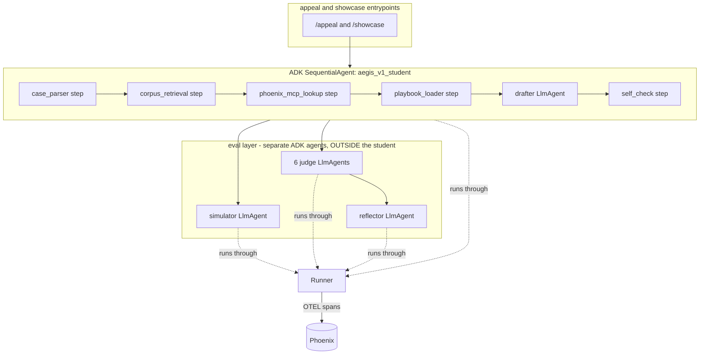

# Plan: Make aegis-v1 genuinely built on ADK (hybrid, full scope)

- Status: Ready to execute (not started)
- Scope: `aegis-v1` only (Part A). Swarm / Part B is explicitly out of scope.
- Author context: written after a verification session that found the v1 product flows bypass the ADK agent entirely. This document is self-contained so it can be executed without that chat.
- Decisions already made by the PM: target architecture = **Hybrid**; component scope = **everything** (drafter + simulator + 6 judges + optimizer/reflection).

---

## 1. Why this work exists (the problem)

Today, ADK is used for only two things in v1:

1. The FastAPI server is built by ADK's `get_fast_api_app(...)` in [backend/app/main_v1.py](../../backend/app/main_v1.py).
2. A single agent `root_agent` is defined in [backend/app/aegis_v1/agent.py](../../backend/app/aegis_v1/agent.py) and registered for the ADK dev playground.

Every real LLM call in v1 is a **raw `google.genai` call** orchestrated by hand-written Python, NOT by ADK:

- Drafter: `GeminiDrafterClient.draft()` in [backend/app/aegis_v1/drafter_client.py](../../backend/app/aegis_v1/drafter_client.py)
- Outcome Simulator: `GeminiSimulatorClient.assess()` in [backend/app/aegis_v1/simulator_client.py](../../backend/app/aegis_v1/simulator_client.py)
- 6 Judges: `GeminiJudgeClient.judge()` in [backend/app/evals/part_a/llm_judges.py](../../backend/app/evals/part_a/llm_judges.py) (around line 241)
- Optimizer/Reflection: `GeminiReflectionClient.reflect()` in [backend/app/learning/reflection_client.py](../../backend/app/learning/reflection_client.py)

All of them route through one shared robustness seam, `generate_content_with_fallback` in [backend/app/gemini_retry.py](../../backend/app/gemini_retry.py).

The product `/appeal` flow ([backend/app/aegis_v1/appeal_orchestrator.py](../../backend/app/aegis_v1/appeal_orchestrator.py) -> [backend/app/aegis_v1/pipeline.py](../../backend/app/aegis_v1/pipeline.py)) and the `/showcase` measurement flow ([backend/app/evals/part_a/measurement_run.py](../../backend/app/evals/part_a/measurement_run.py)) both call `run_aegis_v1_pipeline`, which calls these raw-genai clients directly. The ADK `root_agent` is never invoked by either.

Consequence: the "agent built on ADK" claim is true only at the framework level, not at the agent-reasoning level. This plan fixes that.

### Gotcha that likely sidelined the ADK agent originally

`root_agent` in [backend/app/aegis_v1/agent.py](../../backend/app/aegis_v1/agent.py) sets BOTH `output_schema=AppealPackage` AND `tools=[...]`. ADK disallows an `LlmAgent` having `output_schema` together with tools / transfer. That combination cannot reliably call tools, which is consistent with the historical note that the ADK agent "sometimes didn't use all tools" and an explicit pipeline endpoint was added instead. The hybrid design below avoids this by making the multi-tool flow a workflow (SequentialAgent), not a single output-schema agent.

---

## 2. Three properties we must NOT break

These were deliberately engineered. Any ADK design must preserve all three:

1. **Guaranteed tool order.** The student runs 6 steps in fixed order: `case_parser -> corpus_retrieval -> phoenix_mcp_lookup -> playbook_loader -> drafter -> self_check` (see `run_aegis_v1_pipeline` in [backend/app/aegis_v1/pipeline.py](../../backend/app/aegis_v1/pipeline.py)).
2. **Reproducible before/after evals.** The showcase runs the SAME case with the OLD vs NEW drafter prompt / playbook to produce a real A/B. The injection seams are `drafter_prompt_version`, `drafter_prompt_text`, `playbook_override` parameters on `run_aegis_v1_pipeline`.
3. **Separation of powers (firewall).** The Outcome Simulator and the Judge panel are invoked OUTSIDE the student, never as tools the student can call. See `run_evaluated_case` in [backend/app/evals/part_a/evaluated_run.py](../../backend/app/evals/part_a/evaluated_run.py) and the `simulator()` docstring in [backend/app/aegis_v1/tools.py](../../backend/app/aegis_v1/tools.py) (line ~543, "Not a Student tool"). Invariants referenced as INV-2 / INV-S2 / INV-S3 / D11.

---

## 3. Target architecture (Hybrid)



- **Student drafting** becomes an ADK `SequentialAgent`. The 5 deterministic steps wrap the existing pure Python functions from [backend/app/aegis_v1/tools.py](../../backend/app/aegis_v1/tools.py); only `drafter` is an `LlmAgent`.
- **Simulator, judges, reflector** become standalone ADK `LlmAgent`s invoked by the existing Python orchestration AFTER the student. They are never sub-agents/tools of the student (firewall preserved).
- Everything runs through an ADK `Runner` so the ADK OpenInference instrumentor traces it in Phoenix.

---

## 4. ADK API facts (verified against google-adk 1.33.0)

> IMPORTANT: the PM upgraded ADK after this was written. Re-run the introspection in Section 4.1 to confirm these still hold. If the install is ADK 2.0+, also evaluate the graph-based Workflow API (`references/adk-2.0.md` in the `google-agents-cli-adk-code` skill) as an alternative to `SequentialAgent` — but the 1.x patterns below are sufficient and lower-risk.

Verified imports and signatures (ADK 1.33.0):

- Agents: `from google.adk.agents import LlmAgent, SequentialAgent, BaseAgent`
- Custom agent step: subclass `BaseAgent`, implement `async def _run_async_impl(self, ctx: InvocationContext) -> AsyncGenerator[Event, None]`.
- Read state inside a step: `ctx.session.state[...]`.
- Write state from a step: `yield Event(author=self.name, actions=EventActions(state_delta={...}))` (`from google.adk.events import Event, EventActions`).
- Runner: `from google.adk.runners import Runner`. Constructor: `Runner(*, agent=..., app_name=..., session_service=..., auto_create_session=bool, ...)`.
  - Sync entrypoint (good for sync FastAPI + background threads): `runner.run(*, user_id, session_id, new_message: types.Content, run_config=None) -> Generator[Event]`.
  - Async entrypoint (supports initial state): `runner.run_async(*, user_id, session_id, new_message=None, state_delta=None, ...) -> AsyncGenerator[Event]`.
- Sessions: `from google.adk.sessions import InMemorySessionService`. `create_session(*, app_name, user_id, state=None, session_id=None)` and `get_session(...)` are BOTH async coroutines.
- LlmAgent fields available: `instruction` (accepts a callable InstructionProvider for dynamic prompts), `output_schema`, `output_key`, `before_model_callback`, `after_model_callback`, `before_agent_callback`, `model`, `disallow_transfer_to_parent`, `disallow_transfer_to_peers`, `tools`.
- `before_model_callback` receives an `LlmRequest` whose `config` and `contents` are mutable (use this to re-home pacing/model-fallback, see Section 5.1).

### 4.1 Re-verification snippet (run first)

```bash
cd backend && .venv/bin/python - <<'PY'
import inspect
from google.adk.agents import LlmAgent, SequentialAgent, BaseAgent
from google.adk.runners import Runner
from google.adk.sessions import InMemorySessionService
from google.adk.events import Event, EventActions
import google.adk as adk
print("adk", getattr(adk, "__version__", "?"))
print(inspect.signature(Runner.run))
print(inspect.signature(Runner.run_async))
print(inspect.signature(InMemorySessionService.create_session))
print("EventActions has state_delta:", "state_delta" in EventActions.model_fields)
print("LlmAgent instruction/output_schema/before_model_callback present:",
      all(f in LlmAgent.model_fields for f in ["instruction","output_schema","before_model_callback"]))
PY
```

---

## 5. Cross-cutting concerns (do these in Phase 0)

### 5.1 Re-home the robustness seam (HIGHEST RISK)

Today [backend/app/gemini_retry.py](../../backend/app/gemini_retry.py) provides three things by wrapping the raw genai call:
- **Pacing** (`_pace`, min interval between calls, default 2s) to avoid rate limits on long serious runs.
- **Retry with exponential backoff** on transient errors (429/5xx/RESOURCE_EXHAUSTED/etc.).
- **Model-availability fallback**: if `gemini-3.1-*` returns 404/NOT_FOUND, retry the identical request on `gemini-3.5-flash` with `thinking_level=high`.

With ADK, the model call happens inside the agent flow, so this wrapper no longer sits in the path. Re-home it. Recommended approach (verify against current ADK docs via `source-driven-development`):

- Implement a `before_model_callback(callback_context, llm_request)` attached to every `LlmAgent` that:
  - calls `_pace()` before the model call (move `_pace` out of gemini_retry into a shared module, or import it);
  - sets the desired model / thinking config.
- For retry + model-availability fallback, the cleanest ADK-native option is a thin custom `BaseLlm` wrapper around `google.genai` that internally uses `generate_content_with_fallback`, then pass it as `LlmAgent(model=<wrapper>)`. This keeps ALL existing retry/fallback semantics verbatim. Evaluate this vs callbacks; the custom-model wrapper is preferred because it reuses the already-hardened `gemini_retry` code unchanged.
- Acceptance: a unit test proving (a) pacing is invoked, (b) a simulated 404 on a `gemini-3.1` name triggers the flash fallback, (c) transient errors are retried. Mirror existing tests in `backend/tests/unit/` that cover `gemini_retry`.

### 5.2 Async/sync bridge

FastAPI endpoints and the showcase background daemon threads are synchronous. Two options:
- Prefer `Runner.run` (the sync generator) where no initial state is needed.
- Where initial state must be seeded (the student needs `denial_text`, `clinical_context`, `case_id`, prompt/playbook overrides), build a small helper that does: create `InMemorySessionService`, `await create_session(state=...)`, drive `run_async`, then read final state via `get_session`. Wrap the whole coroutine with `asyncio.run(...)` for sync callers; if already inside a running loop (rare here), fall back to a dedicated thread executing `asyncio.run`.

Create one helper module, e.g. `backend/app/aegis_v1/adk_runtime.py`, exposing:
- `run_agent_sync(agent, *, app_name, initial_state: dict) -> dict` returning the final session state (so callers extract typed outputs by key).
- A shared `make_model()` returning the custom retry/fallback model wrapper from 5.1.

### 5.3 Phoenix content capture / PHI (SAFETY DECISION)

`OTEL_INSTRUMENTATION_GENAI_CAPTURE_MESSAGE_CONTENT="true"` is set in [backend/app/app_utils/telemetry.py](../../backend/app/app_utils/telemetry.py) with `register(auto_instrument=True)`. Once v1 LLM calls run through ADK, the ADK instrumentor WILL export full prompt content (including the denial-letter text, which lives in `parsed_case.denial_text` and is embedded in the drafter/simulator prompts) to Phoenix.

- Showcase holdout cases are synthetic composite cases (safe per AGENTS.md).
- The `/appeal` product path can carry real user PHI.

Decision required before Phase 1 ships to the live product path. Options:
- (A) Set `OTEL_INSTRUMENTATION_GENAI_CAPTURE_MESSAGE_CONTENT="false"` so spans capture structure/metadata but not raw message text. Safe default; reduces demo richness slightly.
- (B) Keep capture on only for the showcase/eval project context (synthetic) and off for `/appeal`.
- (C) Redact `denial_text`/`clinical_context` before they enter prompts — NOT viable, the model needs that text to draft.

Recommended default: (A) globally, and revisit if the demo specifically needs raw prompts visible for synthetic cases. This is a product/safety decision; do not flip silently.

### 5.4 Feature flag + fallback

Add an env flag `AEGIS_USE_ADK` (default `false` initially). Each converted layer checks the flag and dispatches to either the new ADK agent path or the existing raw-genai client. Keep the old clients as a tested fallback (matches the PM's standing "keep the old path just in case" preference). Flip default to `true` only in Phase 5 after live rehearsal.

### 5.5 Preserve DI seams for offline tests

The offline fakes keep the ~29 backend tests green without live creds:
- `StubDrafterClient` ([backend/app/aegis_v1/drafter_client.py](../../backend/app/aegis_v1/drafter_client.py))
- `StubSimulatorClient` ([backend/app/aegis_v1/simulator_client.py](../../backend/app/aegis_v1/simulator_client.py))
- `OfflineHeuristicJudgeClient` ([backend/app/evals/part_a/llm_judges.py](../../backend/app/evals/part_a/llm_judges.py))
- `StubReflectionClient` ([backend/app/learning/reflection_client.py](../../backend/app/learning/reflection_client.py))

Strategy: ADK agents should be constructed with the custom model wrapper for live use, but tests run with the flag OFF (raw path + stubs) AND a new parallel set runs the flag ON using ADK with a fake/echo model so no creds are needed. Do not delete the stubs.

---

## 6. Phase-by-phase tasks

Each phase is independently shippable: code + tests + green suite + a working commit before moving on.

### Phase 0 — ADK foundations
- Create `backend/app/aegis_v1/adk_runtime.py` with `run_agent_sync(...)` (5.2) and `make_model()` (5.1).
- Re-home `gemini_retry` into the custom model wrapper; add unit tests for pacing/retry/fallback parity.
- Decide and apply the Phoenix content-capture policy (5.3).
- Add the `AEGIS_USE_ADK` flag plumbing (5.4).
- Exit criteria: foundations importable; a smoke test runs a trivial ADK `LlmAgent` end to end with a fake model via `run_agent_sync`.

### Phase 1 — Student drafting as ADK SequentialAgent
- New module e.g. `backend/app/aegis_v1/student_agent.py`:
  - 5 custom `BaseAgent` steps wrapping `case_parser`, `corpus_retrieval`, `phoenix_mcp_lookup`, `playbook_loader`, `self_check` from [backend/app/aegis_v1/tools.py](../../backend/app/aegis_v1/tools.py). Each reads inputs from `ctx.session.state` and writes outputs via `EventActions(state_delta=...)`.
  - 1 `LlmAgent` `drafter` whose `instruction` is a dynamic InstructionProvider that reads the active or overridden prompt + playbook from state (preserves `drafter_prompt_text` / `playbook_override`). Reuse `load_drafter_prompt` / `get_active_drafter_prompt_version` from [backend/app/aegis_v1/drafter_client.py](../../backend/app/aegis_v1/drafter_client.py). Output captured to a state key; then apply existing `apply_guardrails` deterministically (keep guardrails in Python, do not trust the model).
  - Assemble the final `AppealPackage` from state exactly as `run_aegis_v1_pipeline` does (same risk-flag merging, same `TraceMetadata`).
- Wire-up behind `AEGIS_USE_ADK`: add an ADK branch inside `run_aegis_v1_pipeline` (so all callers — `/appeal` via `run_appeal_with_outcome`, `run_measurement_case`, `run_evaluated_case` — benefit without each being edited). This is the lowest-blast-radius integration point.
- Tests: assert identical `AppealPackage` shape/fields vs the legacy path on a fixture case (flag off vs on, using a fake model); assert tool order; assert prompt override changes the drafted letter.
- Exit criteria: `/appeal` and showcase measurement run through the SequentialAgent with the flag on; legacy path unchanged with flag off.

### Phase 2 — Outcome Simulator as standalone ADK LlmAgent
- New `LlmAgent` mirroring `_build_assess_prompt` and the `_Assessment` schema in [backend/app/aegis_v1/simulator_client.py](../../backend/app/aegis_v1/simulator_client.py). Use `output_schema` = the feature-assessment schema.
- Keep deterministic `score_outcome` + `load_simulator_rules` in Python (verdict is computed deterministically downstream, INV-S2/S3).
- Integrate at the existing seam: the `simulator()` function in [backend/app/aegis_v1/tools.py](../../backend/app/aegis_v1/tools.py) (line ~543) gains an ADK branch behind the flag, so `appeal_orchestrator` and `evaluated_run` are unchanged.
- Firewall check: the simulator agent is built and run by the orchestration layer only; it is NOT added to the student SequentialAgent's sub-agents or tools.
- Tests: parity of `FeatureAssessment` -> `score_outcome` output vs legacy; firewall assertion (simulator never appears under the student).

### Phase 3 — 6 judges as ADK LlmAgents
- For each judge id in `JUDGE_IDS` ([backend/app/evals/part_a/panel.py](../../backend/app/evals/part_a/panel.py)): an `LlmAgent` with the judge prompt (`load_judge_prompt`) and `output_schema=JudgeResult`. Consider a `ParallelAgent` for the 5 quality judges; j2 (faithfulness) stays gated by `citation_precheck` first.
- Replace the `client.judge(...)` calls inside `run_panel` with an ADK-backed `JudgeClient` implementation (new class implementing the existing `JudgeClient` protocol from [backend/app/evals/part_a/llm_judges.py](../../backend/app/evals/part_a/llm_judges.py)), selected behind the flag.
- Keep ALL deterministic logic in Python: `safety_scope_gate`, `citation_precheck` ([backend/app/evals/part_a/deterministic_gates.py](../../backend/app/evals/part_a/deterministic_gates.py)), weighting, hard gates, evidence-quote verbatim checks.
- Keep `OfflineHeuristicJudgeClient` for offline tests.
- Tests: parity of `PanelReport` vs legacy on a fixture (flag off vs on with fake model); deterministic gates unaffected.

### Phase 4 — Optimizer / reflection as ADK LlmAgent
- New `LlmAgent` mirroring `build_reflection_prompt` in [backend/app/learning/reflection_client.py](../../backend/app/learning/reflection_client.py). Implement a new class satisfying the `ReflectionClient` protocol, selected behind the flag; keep `StubReflectionClient`.
- The `LearningCoordinator.optimize()` loop in [backend/app/learning/coordinator.py](../../backend/app/learning/coordinator.py) and `LiveExperimentRunner` ([backend/app/learning/experiment.py](../../backend/app/learning/experiment.py)) stay as Python orchestration; only the model call inside reflection moves to ADK.
- Preserve the safety constraints injected in `_REFLECTION_CONSTRAINTS` (disclaimer, citation-only, no-exclamation, do-not-optimize-toward-verdict).
- Tests: a reflection round with a fake model returns a bumped `Component`; failure path returns the component unchanged (no crash), matching current behavior.

### Phase 5 — Cleanup + verification
- Flip `AEGIS_USE_ADK` default to `true`.
- Demote raw-genai clients to offline/fallback role (do not delete; keep as fallback + test fakes).
- Live credentialed rehearsal: one `/appeal` call and one quick showcase run.
- Confirm in Phoenix that traces now show genuine ADK agent + tool spans (not only the app-level `OtelPhoenixRecorder` spans), and that the firewall holds (simulator/judges never under the student).
- Update docs: [docs/architecture/2026-05-27-aegis-arch.md](../architecture/2026-05-27-aegis-arch.md), a new ADR under [docs/adr/](../adr/), [docs/memory/decision-log.md](../memory/decision-log.md), [docs/memory/current-state.md](../memory/current-state.md), and [backend/AGENTS.md](../../backend/AGENTS.md) (note the ADK-native flows + content-capture policy).

---

## 7. Files inventory (what gets created vs edited)

New files:
- `backend/app/aegis_v1/adk_runtime.py` (runner helper + model wrapper)
- `backend/app/aegis_v1/student_agent.py` (SequentialAgent + steps + drafter LlmAgent)
- `backend/app/aegis_v1/simulator_agent.py` (simulator LlmAgent)
- `backend/app/evals/part_a/judge_agents.py` (judge LlmAgents + ADK JudgeClient)
- `backend/app/learning/reflection_agent.py` (reflector LlmAgent)
- Tests under `backend/tests/unit/aegis_v1/` and `backend/tests/unit/evals/` and `backend/tests/unit/learning/` for each phase.

Edited (integration seams, behind the flag):
- [backend/app/aegis_v1/pipeline.py](../../backend/app/aegis_v1/pipeline.py) (student ADK branch)
- [backend/app/aegis_v1/tools.py](../../backend/app/aegis_v1/tools.py) (`simulator()` ADK branch)
- [backend/app/evals/part_a/panel.py](../../backend/app/evals/part_a/panel.py) (ADK judge client selection)
- [backend/app/learning/reflection_client.py](../../backend/app/learning/reflection_client.py) (ADK reflection selection) or wire selection in [backend/app/learning/run_live.py](../../backend/app/learning/run_live.py)
- [backend/app/app_utils/telemetry.py](../../backend/app/app_utils/telemetry.py) (content-capture policy)
- [backend/app/gemini_retry.py](../../backend/app/gemini_retry.py) (expose `_pace` / reuse from model wrapper)

Do NOT edit (keep working as fallback): the existing `Gemini*Client` classes, the stubs, the deterministic gates, the scoring functions.

---

## 8. Testing strategy

- Keep the entire existing suite green with `AEGIS_USE_ADK` unset/false: `cd backend && uv run pytest`.
- Add per-phase parity tests that run the SAME fixture through legacy vs ADK (ADK with a fake/echo model so no creds needed) and assert structural equality of the public artifact (`AppealPackage`, `FeatureAssessment`->score, `PanelReport`, `Component`).
- Add a firewall test: introspect the student `SequentialAgent` sub-agent tree and assert no simulator/judge/reflector agent is present.
- Add a robustness test for the model wrapper (Section 5.1).
- Frontend: no changes expected; `/appeal` and `/showcase` response schemas are unchanged.

---

## 9. Open decisions (must be confirmed, not silently chosen)

1. Robustness re-homing approach: custom `BaseLlm` model wrapper (recommended, reuses `gemini_retry` verbatim) vs callbacks. Confirm against current ADK version.
2. Phoenix content-capture policy (Section 5.3): recommend disabling raw message content capture by default for PHI safety. Product/safety decision.
3. If ADK is now 2.0+: whether to use the graph Workflow API instead of `SequentialAgent`. Default recommendation: stay on 1.x SequentialAgent patterns for lower risk unless there's a reason to adopt 2.0.

---

## 10. Acceptance criteria (done = all true)

- `/appeal` and `/showcase` drafting run through an ADK `SequentialAgent`; simulator, judges, and reflector run as separate ADK `LlmAgent`s.
- Phoenix shows real ADK agent + tool spans for a live run; the student/simulator/judge firewall is visible and intact.
- All three preserved properties (Section 2) still hold: fixed tool order, reproducible before/after, firewall.
- Existing tests pass with the flag off; new parity + firewall + robustness tests pass with the flag on.
- The robustness seam (pacing, retry, model fallback) is preserved.
- Content-capture / PHI policy explicitly decided and applied.
- Docs/ADR/memory updated.
