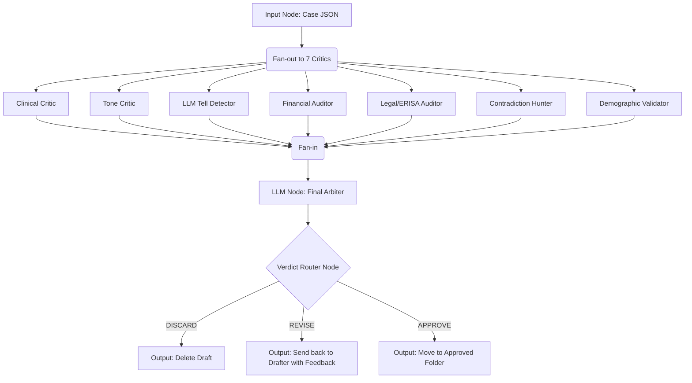

# Gumloop Swarm: Synthetic Case Realism Evaluation

This folder contains the architecture and prompts for the Gumloop multi-agent flow designed to evaluate the realism of synthetic denial cases.

## Orchestration Pattern
**Parallel** (7 specialist critics fan-out, 1 aggregator fans-in). This minimizes latency and prevents the critics from biasing each other.

## Wiring Diagram (Gumloop Flow)

## Setup Instructions for Gumloop
1. Create an **Input Node** that takes the raw `JSON` of a synthetic case.
2. Create a **Branching/Parallel Map Node** (if supported) or simply 7 sequential LLM nodes that do not reference each other.
3. Paste the prompts from the `/prompts` folder into each respective LLM Node.
4. Set the system prompt of each LLM node to return exactly two lines:
   - Line 1: A score from 1 to 5.
   - Line 2: A 1-sentence justification.
5. Create a final LLM Node (The Arbiter) and feed the outputs of all 7 Critics into its prompt.
